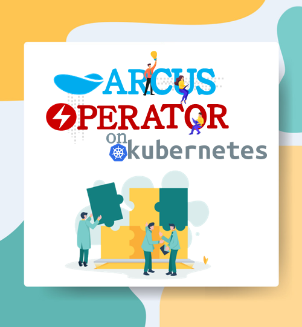
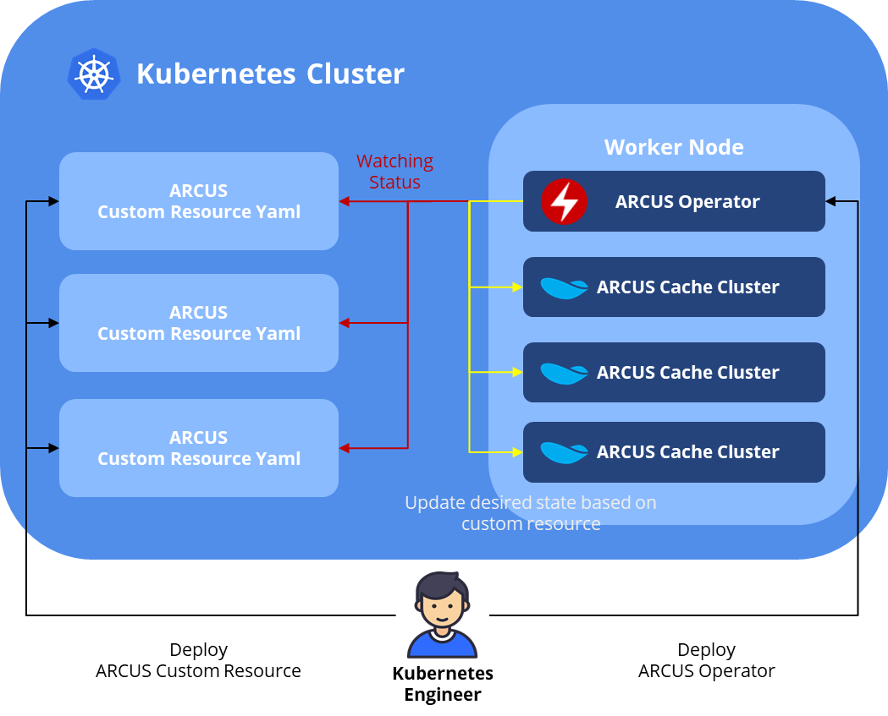

# ARCUS Operator on Kubernetes

</img>

## What is an Operator?

Over the last few years, many companies have abandoned traditional Monolith architecture and have adopted Microservice architecture and by that naturally changing the way the software operates. As container technologies are becoming more popular, Kubernetes — a representative orchestration tool that naturally helps automate distributed container environments is increasingly being used.
The benefits of the container orchestration technology such as Kubernetes’ scheduling, scaling, self-healing, resource management and etcetera to automate the operation of application services are enormous. However, moving applications and external solutions running in existing On-Premise environments to Kubernetes are not easy. It’s easy for stateless applications to operate with simple Kubernetes resource creation. When it comes to stateful applications such as distributed caches, databases and monitoring systems the basic functionality of Kubernetes alone is limited. Besides depending on the complexity of the application, a domain-specific operator is essential. These operational challenges make it difficult to take full advantage of Kubernetes’ automation.
An operator is a framework developed by CoreOS, which abstracts the workload of complex applications and allows you to operate in a Kubernetes environment, overcoming the limitations of operational automation of applications. This is done by packaging applications using Kubernetes’ [Custom Resources](https://kubernetes.io/docs/concepts/extend-kubernetes/api-extension/custom-resources/) (CR). o automate tasks beyond the basic capabilities provided by Kubernetes it uses a method of implementing controller code to manage CR’s state. An operator framework provides the Boilerplate code for developers to easily implement these controllers.

For more information about the Operator Framework, you can check the links below.

- [Operator Homepage](https://operatorframework.io)
- [Operator Introduction](https://coreos.com/blog/introducing-operators.html)
- [Operator-SDK](https://coreos.com/blog/introducing-operators.html)

## ARCUS OPERATOR

[ARCUS](https://github.com/naver/arcus) cache cluster is one of the complex applications that difficult to operate not just On-Premise environments but as well as on Kubernetes. Scaling requires cache service update, migration requires to prevent data loss and when rolling updates occur, the update should be performed taking into account the replication group structure to maintain replication data. These tasks cannot be performed solely by the basic functions of Kubernetes and there is an inconvenience of having to be manually handling them. To automate the process, logic needed for the operation is implemented in the form of the code and you must be able to execute the pre-implemented logic whenever the state of the cache cluster changes.

</img>
  
Logics required for ARCUS operation have been implemented in Operator Controller is the ARCUS Operator. When you deploy the cache cluster to Kubernetes via ArcusMemcached CR, ARCUS Operator’s controller monitors the CR’s state and thus you can have automated ARCUS operations performing state-specific logic.
For example, the internal behaviors of the ARCUS Operator are as follow:
1. Comparison of the CR specifications with the current state of the cache cluster.
2. Execution of the pre-operational logic according to the CR specifications.
3. Update the status of the CR to meet the specifications.

If you use ArcusMemcached CR provided by the ARCUS Operator as shown below and suppose you scale by increasing the number of cache nodes in a cache cluster from 3 to 5, the controller of the ARCUS Operator will operate as follows:

#### arcus_memcached.yaml
```yaml
apiVersion: jam2in.com/v1
kind: ArcusMemcached
metadata:
  name: test
spec:
  replicas: 5 # a state that used to be 3
  serviceCode: test
  zookeeperServers:
    - 1.2.3.4:2181
  configuration:
    memlimit: 100
    connections: 1000
    threads: 10
  image:
    name: jam2in/arcus-memcached:1.11.7
    pullPolicy: Always
```

```
$ kubectl apply -f arcus_memcached.yaml
```

1. Comparison of the ArcusMemcached CR’s replica (5) value with the number of cache nodes (3) currently being run in the `test` cache service.
2. To change the number of cache nodes in `test` cache service as much as ArcusMemcached’s CR replica (5) value, connect to ZooKeeper and register two more nodes in the `test` cache service.
3. Update the status to create two additional cache node containers for the `test` cache service (statefulset resource’s CR replica set to 5).

## HOW TO USE
In order to create a cache cluster, deploy ARCUS Operator to Kubernetes and finally, we will create and test our application using ARCUS, which works in a Kubernetes environment.

## ROLE-BASED ACCESS CONTROL (RBAC) GENERATION
Inside the ARCUS Operator, there are controllers that manage the status of the CR. The controller monitors the CR’s state and to meet the desired state using the Kubernetes API it generates Kubernetes’ built-in resources and manages them. To do this, the Kubernetes API of the ARCUS Operator requires settings for permission. Use the `kubectl` command as shown below to create a service account and permission for the ARCUS Operator.

#### arcus_rbac.yaml
```yaml
apiVersion: v1
kind: ServiceAccount
metadata:
  name: arcus-operator

---

apiVersion: rbac.authorization.k8s.io/v1
kind: ClusterRole
metadata:
  creationTimestamp: null
  name: arcus-operator
rules:
- apiGroups:
  - ""
  - apps
  resources:
  - pods
  - services
  - configmaps
  - statefulsets
  verbs:
  - get
  - list
  - watch
  - create
  - update
- apiGroups:
  - policy
  resources:
  - poddisruptionbudgets
  verbs:
  - get
  - list
  - watch
  - create
  - delete
- apiGroups:
  - monitoring.coreos.com
  resources:
  - servicemonitors
  verbs:
  - get
  - create
- apiGroups:
  - jam2in.com
  resources:
  - memcacheds
  - memcacheds/status
  verbs:
  - get
  - list
  - watch
  - update

---

apiVersion: rbac.authorization.k8s.io/v1
kind: ClusterRoleBinding
metadata:
  name: arcus-operator
subjects:
- kind: ServiceAccount
  name: arcus-operator
  namespace: default
roleRef:
  kind: ClusterRole
  name: arcus-operator
  apiGroup: rbac.authorization.k8s.io
---

apiVersion: rbac.authorization.k8s.io/v1
kind: ClusterRoleBinding
metadata:
  name: arcus-operator
subjects:
- kind: ServiceAccount
  name: arcus-operator
  namespace: default
roleRef:
  kind: ClusterRole
  name: arcus-operator
  apiGroup: rbac.authorization.k8s.io
```

```
$ kubectl apply -f arcus_rbac.yaml
serviceaccount/arcus-operator created
clusterrole.rbac.authorization.k8s.io/arcus-operator created
clusterrolebinding.rbac.authorization.k8s.io/arcus-operator created
```

## CUSTOM RESOURCE DEFINITION (ArcusMemcached) GENERATION
Create a Custom Resource Definition (CRD) for the ARCUS cache cluster. After completing creation, users will be able to use other built-in resources with `kubectl` command or API to create and manage the ArcusMemcached CR. CRD includes the CR’s API group, resource names, status, and validating information.

#### arcus_memcached_crd.yaml
```yaml
apiVersion: apiextensions.k8s.io/v1beta1
kind: CustomResourceDefinition
metadata:
  name: memcacheds.jam2in.com
spec:
  group: jam2in.com
  names:
    kind: ArcusMemcached
    listKind: ArcusMemcachedList
    plural: memcacheds
    singular: memcached
    shortNames:
      - mc
  scope: Namespaced
  version: v1
  subresources:
    status: {}
  additionalPrinterColumns:
  - name: Age
    type: date
    JSONPath: .metadata.creationTimestamp
  - name: Ready
    type: string
    description: The number memcached nodes ready
    JSONPath: .status.ready
  - name: Container
    type: string
    description: The memcached container
    JSONPath: .status.container
  - name: Image
    type: string
    description: The memcached image
    JSONPath: .status.image
  - name: Message
    type: string
    description: The memcached error message
    JSONPath: .status.message
```

```
$ kubectl apply -f arcus_memcached_crd.yaml
customresourcedefinition.apiextensions.k8s.io/memcacheds.jam2in.com created
```

```
$ kubectl get crd
NAME                    CREATED AT
memcacheds.jam2in.com   2020-08-26T02:02:25Z
```

## ARCUS OPERATOR GENERATION
Once you have completed the course so far, from now on like any other Kubernetes resources, you can create an ArcusMemcached CR using the `kubectl` command. Although, if you generate CR in this state, the ARCUS cache cluster will not be deployed as a container to Kubernetes, no action will be taken and that is because a container has not yet been created to monitor and control the status of the ArcusMemcached CR.

In order to do this, you must create a Deployment for the ARCUS Operator. In the Deployment spec below replicas indicate the number of Pod will be created. If the replicas are set to more than N, then one of the deployed N Pods is given the Master role, the rest will remain in the Stand-by state. If the Master is down, one of the Pods in the Stand-by state will take the Master’s role.

#### arcus-operator.yaml
```yaml
apiVersion: apps/v1
kind: Deployment
metadata:
  name: arcus-operator
spec:
  replicas: 3
  selector:
    matchLabels:
      name: arcus-operator
  template:
    metadata:
      labels:
        name: arcus-operator
    spec:
      serviceAccountName: arcus-operator
      containers:
        - name: arcus-operator
          image: jam2in/arcus-operator:0.0.6
          command:
          - arcus-operator
          imagePullPolicy: Always
          env:
            - name: WATCH_NAMESPACE
              value: ""
            - name: POD_NAME
              valueFrom:
                fieldRef:
                  fieldPath: metadata.name
            - name: OPERATOR_NAME
              value: "arcus-operator"
```

```
$ kubectl apply arcus-operator.yaml
deployment.apps/arcus-operator created
```

```
$ kubectl get deployments
NAME             DESIRED   CURRENT   UP-TO-DATE   AVAILABLE   AGE
arcus-operator   3         3         3            3           13s
```

```
$ kubectl get pods
NAME                             READY     STATUS    RESTARTS   AGE
arcus-operator-7647cf945-2gt4v   1/1       Running   0          1m
arcus-operator-7647cf945-8mhgn   1/1       Running   0          1m
arcus-operator-7647cf945-wqdc9   1/1       Running   0          1m
```

## ArcusMemcached (CUSTOM RESOURCE) GENERATION
Finally, create an ArcusMemcached CR to deploy the ARCUS cache cluster to Kubernetes. When you complete the creation, a cache cluster named test will be created with a total of three units of a cache server.

#### arcus_memcached.yaml
```yaml
apiVersion: jam2in.com/v1
kind: ArcusMemcached
metadata:
  name: test
spec:
  # number of container when cache node will be created
  replicas: 3
  # service code
  serviceCode: test
  # ZooKeeper server address to manage the cache cluster
  zookeeperServers:
    - 1.2.3.4:2181
  # Operating options for the cache process
  configuration:
    memlimit: 100
    connections: 1000
    threads: 10
  # Image information of ARCUS Memcached's Docker
  image:
    name: jam2in/arcus-memcached:1.11.7
    pullPolicy: Always
```

```
$ kubectl apply -f arcus_memcached.yaml
arcusmemcached.jam2in.com/jam2in created
```

```
$ kubectl get pods
NAME                             READY     STATUS    RESTARTS   AGE
arcus-operator-7647cf945-9hlqp   1/1       Running   0          59m
arcus-operator-7647cf945-tc6ld   1/1       Running   0          59m
arcus-operator-7647cf945-z4d74   1/1       Running   0          51m
test-arcus-mc-0                  1/1       Running   0          16m
test-arcus-mc-1                  1/1       Running   0          16m
test-arcus-mc-2                  1/1       Running   0          16m
```

## TEST
We will create an application to test the behavior of the containerized ARCUS cache cluster on Kubernetes. To do this, create a Deployment YAML file as shown below and deploy it. As the container environment variables, `ARCUS_ADDRESS` is set to the ZooKeeper address, `ARCUS_SERVICE_CODE` is set to the service code that just created ArcusMemcached CR.

#### application.yaml
```yaml
apiVersion: apps/v1
kind: Deployment
metadata:
  name: arcus-application-sample
  labels:
    app: arcus-application-sample
spec:
  replicas: 1
  selector:
    matchLabels:
      app: arcus-application-sample
  template:
    metadata:
      labels:
        app: arcus-application-sample
    spec:
      containers:
        - name: arcus-application-sample
          image: jam2in/arcus-application-sample:0.0.1
          ports:
          - containerPort: 80
          env:
          - name: ARCUS_ADDRESS
            value: "10.34.33.81:7189"
          - name: ARCUS_SERVICE_CODE
            value: "test"

---

apiVersion: v1
kind: Service
metadata:
  name: arcus-application-sample
  labels:
    app: arcus-application-sample
spec:
  ports:
  - port: 8080
    protocol: TCP
  selector:
    app: arcus-application-sample
```

```
$ kubectl apply -f application.yaml
deployment.apps/arcus-application-sample created
service/arcus-application-sample created
```

Check the [link](https://github.com/jam2in/arcus-docker/blob/master/arcus-application-sample/arcus-application-sample/src/main/java/com/jam2in/arcus/application/controller/HomeController.java#L15-L29) for the application code for testing. When an application request comes, it checks the item on the cache server with the `kubernetes:arcus` key. We have implemented the following response messages as a request output: `hello spring!`— if a cache item does not exist and `hello arcus`! — if a cache item exists, also if an item not found, it will save `hello arcus!` to the cache server.

After confirming that the application is running, send a request to the application’s service to proceed with the test.

```
$ kubectl get pods
NAME                                        READY     STATUS    RESTARTS   AGE
arcus-application-sample-85bf8d5d6d-hp67n   1/1       Running   0          18m
arcus-operator-7647cf945-9hlqp              1/1       Running   0          1h
arcus-operator-7647cf945-tc6ld              1/1       Running   0          1h
arcus-operator-7647cf945-z4d74              1/1       Running   0          1h
test-arcus-mc-0                             1/1       Running   0          43m
test-arcus-mc-1                             1/1       Running   0          43m
test-arcus-mc-2                             1/1       Running   0          42m
```

```
$ kubectl get svc arcus-application-sample
NAME                       TYPE        CLUSTER-IP      EXTERNAL-IP   PORT(S)    AGE
arcus-application-sample   ClusterIP   10.108.36.196   <none>        8080/TCP   18m
```

```html
$ curl 10.108.36.196:8080
<!DOCTYPE html>
<html>
<head>
    <meta charset="UTF-8">
    <title>ARCUS TEST</title>
</head>
<body>
    <h1>hello spring!</h1>
</body>
</html>
```

At first, the item with the `kubernetes:arcus` key did not exist on any cache servers, so we received a `hello spring!` message. If the request was successful, the application logic would have saved a `hello arcus!` on the cache server. Let’s send another request here to verify if the caching is done properly.

```html
$ curl 10.108.36.196:8080
<!DOCTYPE html>
<html>
<head>
    <meta charset="UTF-8">
    <title>ARCUS TEST</title>
</head>
<body>
    <h1>hello arcus!</h1>
</body>
</html>
```

The TTL of the cache item in the application is set to 10 seconds. After 10 seconds, send the request again to verify that the cache item has been successfully removed.

```html
$ curl 10.108.36.196:8080
<!DOCTYPE html>
<html>
<head>
    <meta charset="UTF-8">
    <title>ARCUS TEST</title>
</head>
<body>
    <h1>hello spring!</h1>
</body>
</html>
```

## CONCLUSION
Since the last year, the ARCUS Operator has been reliably operating on real services of a large internet company of Korea that have adopted Kubernetes. However, the ARCUS Operator so far developed here provides only minimal functionality for the basic operations of the ARCUS cache cluster. The ARCUS Enterprise version provides feature-rich functionalities such as replication and migration capabilities. They also will be available in the ARCUS Operator in order to have a more reliable ARCUS cache cluster operations in a Kubernetes environment. The future plan is to further enhance the operational stability and automation of the ARCUS Operator with the additional features listed below.

### Additional features to be provided by ARCUS Operator in the future

- Support for Zookeeper Dynamic Configuration during operations with ARCUS ZooKeeper’s CR.
- Support for migration automation to prevent data loss during scaling.
- Support replication for highly available services.
- Support automatic scaling based on resource usage.
- Helm Chart Support for resource packaging.

Unfortunately, the ARCUS Operator is not public on GitHub and it is only available to customers who have subscribed to Enterprise Edition. For further questions regarding the ARCUS Operator or anything related to ARCUS please feel free to contact support@jam2in.com.
