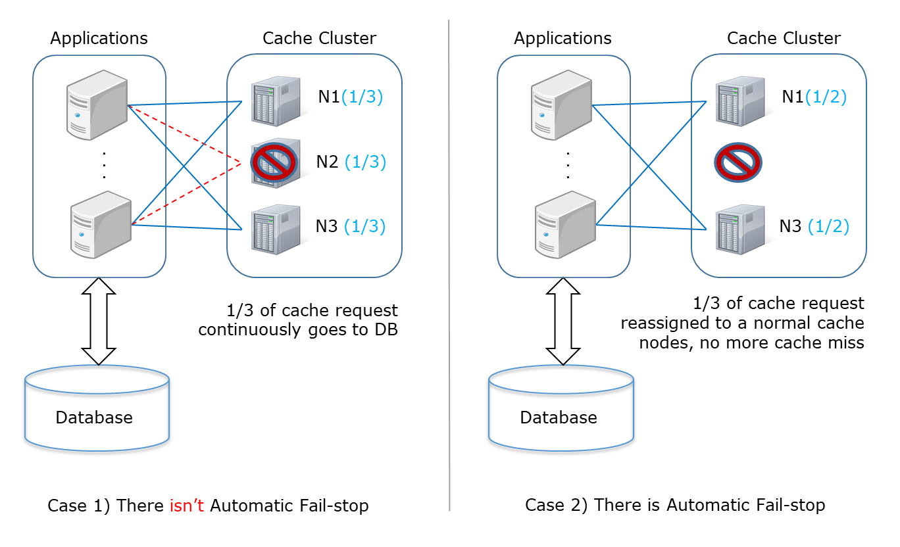
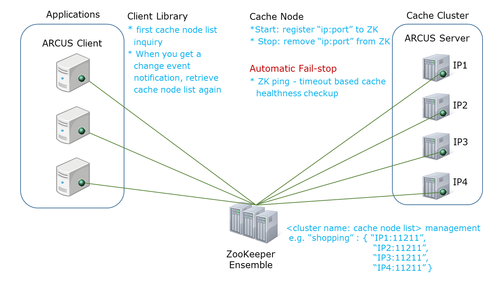
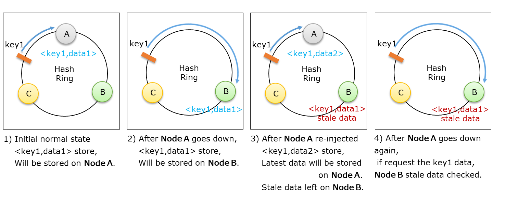

# Significance Of Fault-Tolerance In The Cache System and How to Provide It

</img>

In order to accelerate service response and increase query throughput in many application services, it has become a common way to apply scalable in-memory cache systems.
The original data of the application services are stored in a persistent store such as DB and the frequently viewed data is stored in an in-memory based cache system
thereby increasing the performance of the application services by quickly processing repeated query requests.
These cache systems will be able to withstand any failure to maintain uninterrupted cache services when they'll be provided with fault-tolerance characteristics.
Henceforward I will be explaining the significance of fault-tolerance in the cache system and how to provide fault-tolerance in the ARCUS cache system.

## Significance of fault-tolerance in the cache system

If a part of the cache system fails to provide a normal cache service, the application will request back to the original data store, DB, 
and the performance improvement that comes from cache use may be eliminated. Therefore, to provide uninterrupted cache service the cache system must have fault-tolerance
that meets the following two points:

1. It must be a cluster system consisting of multiple cache nodes.
   - even if some cache nodes fail, other normal cache nodes still can provide cache services.
2. The failed cache node should be removed from the cluster immediately.
   - the current configuration must be changed immediately so that cluster can be configured only with normal cache nodes.
   - to prevent application requests from entering failed cache nodes, remove a failed cache nodes from the cluster's cache node list.
   - cache clients of the application should also be aware of the modified cache node list so their requests should only be sent to normal cache nodes.
   
The first point above is easily understandable, thus omitting additional explanations, let me explain the second point with an illustration. In the figure below,
in a cluster of three cache nodes, each cache nodes take charge of 1/3 of a total cache data, and if N2 cache node fails, 
(1)the case of leaving the failed cache node in the cluster and (2) the case of immediate removal from the cluster, will be explained separately. 
In this article, from now on we will use the term *automatic failstop* in order to refer to the ability to automatically remove failed cache nodes from the cluster. 
FYI: the fail-remove term may be more familiar, but the fail-stop term is more appropriate.

**Case I:** when there is no automatic failstop. 
  - the failed N2 cache node still belongs to the cache cluster.
  - all requests sent to the failed N2 cache node have failed and will be re-request from DB; hence 1/3 of the total cache request will be continuously going to DB.
  - DB requests generally show slow response and low throughput, which can lead to poor application service performance.
  
**Case II:** when there is an automatic failstop.
  - the failed N2 cache node is removed from the cache cluster and the N1 and N3 cache nodes are in charge of 1/2 of the total cache data.
  - the first 1/3 cache request enters the DB due to cache miss, but the cache service is normalized after re-cached on N1 and N3 cache nodes.
  
  </img>
  
  Failures of the cache node can occur at any time (at night, weekend, etc.) and from an operational point of view, you can see a big difference between the two cases
  shown above. If a cache node failure causes a persistent high load on the DB and reduces application service performance, the most difficult part is that operator 
  has to take action quickly. From an operational point of view comparison  is shown as follows:
  
  - Case 1, requires immediate action by the operator or automation script.
    - the failed cache node should be restarted or quickly removed from the cache cluster.
    - it is unreasonable for operators to take action directly at night when everyone is asleep or on weekends when they are with their families, 
      and for this, they may need a separate night/weekend operator as well.
    - if it is a hardware failure, such as memory failure, it may be impossible to restart the cache node with just an automation script.
    - therefore, it is necessary to have sufficient DB throughput in advance so that the quality of the application service does not deteriorate in the event of a cache node failure.
    
  - Case 2, there is no need for an operator's immediate commitment.
    - the cache system automatically removes the failed cache node, so the operator does not need to intervene immediately.
    - operator can go to work during business hours, identify and resolve the cause of the cache node's failure, and then re-inject the cache node.
    
  You can remove a failed cache node from the cache system because it is not persistent storage. This is because cache data can be obtained by querying the original data
  store again, and it can be cached back into the cache system. If the original data store fails, and since there should be no data loss you should be able to restore  immediately from a data recovery or the most common form - data replication that should failover to other existing repositories before recovery.
  
  
  ## Fault-Tolerant ARCUS Cache Cluster
  
  [The ARCUS cache cluster](https://github.com/naver/arcus) is using a high-available [ZooKeeper system](https://zookeeper.apache.org/) and utilizes below described the ZooKeeper functions to implement the automatic failstop feature of the cache system.
  
 - With the ZooKeeper Watcher, it shares a list of the latest cache nodes to all cache clients in real-time.
    - all cache clients that create the Watcher in the cache node list receive real-time event notifications as soon as changes occur in that cache node list, and retrieves the latest cache node list again.
    - in this way, all cache clients always have the latest cache node list.
    
 - With the ZooKeeper Ephemeral Node, it implements the basic automatic failstop function of the ARCUS cache.
    - The ZooKeeper node is a unit of data that is stored in the ZooKeeper. As a type of ZooKeeper node,it's a persistence node that has permanently stored data, and an ephemeral node has temporary data that exists only while the ZooKeeper connection (or session) that generated the node is alive.
    - All cache nodes connected to ZooKeeper registers their cache node information as the ephemeral node type and maintain their connection with ZooKeeper. 
     When the cache node is terminated properly, remove the created ephemeral node and disconnect it from the ZooKeeper.
    - If the cache node goes down abnormally and the connection to the ZooKeeper is lost, the ephemeral znode data is automatically removed and through this, 
      a basic automatic failstop function is implemented.
    - These changes in the cache node list shared among all cache clients with the ZooKeeper watcher feature described earlier.
    
 - With the ZooKeeper Ping, it checks timeout based cache node health status to implement an automatic failstop function.
    - Periodically exchange the ZooKeeper ping data for all cache nodes being connected to ZooKeeper.
    - If the ZooKeeper ping data is not exchanged, the ZooKeeper connection with the corresponding cache node expires, and the ephemeral znode created by the connection also disappears.

The ZooKeeper function above implements the basic automatic failstop function and also implements horizontal scalability of the ARCUS cache cluster.
Let me explain an illustrated structure of the  Scalable and Fault-Tolerant ARCUS cache cluster implemented by using ZooKeeper as shown below.

1. The ZooKeeper Ensemble at the bottom of the figure manages the "IP: Port" list of cache nodes for each cache cluster.
2. When the cache node starts running it adds its "IP: Port" information to this list, and once the cache node is terminated properly, it removes its 
"IP: Port" information from this list.
3. The cache node list is viewed and held by the ARCUS cache client at application run time, if the list is changed due to the addition and removal of the cache node,
  the change event alarm is immediately received and the latest cache node list is retrieved. The application uses a [consistent hashing](https://en.wikipedia.org/wiki/Consistent_hashing) based on the latest cache nodes list to allocate and distribute the request to the cache node where it will store and retrieve the cache data.
4. If the ZooKeeper ephemeral node and the ZooKeeper ping detect failures such as process down, hardware failure, or network failure on the cache node, 
  it will automatically remove the "IP: Port" information of the failed cache node and stop it.
  
 </img>
 
## Cache Node's hang Fault Detection: mc heartbeat feature

ARCUS cache node has a hang condition in which it cannot serve properly when the aforementioned Zookeeper ephemeral node and Zookeeper ping functions fail in fault detection. To detect this hang condition the ARCUS cache node sends itself a few cache requests and it has the mc heartbeat function
to check if the response is on time, and it is performed periodically. FYI: the term mc heartbeat is an extension of the ARCUS cache node based on Memcached
which refers to the heartbeat. Even if the mc heartbeat fails, the ARCUS cache node can remove and terminate the ephemeral node by itself and resulting in an automatic failstop.
  
 ## Stale data removal: Automatic scrub stale feature
 
The ARCUS cache cluster can scale out horizontally and automatically in order to remove failed cache nodes with the automatic failstop feature. 
ARCUS cache client on the application performs the constant hashing based logic on the latest cache node list and by distributing the cache data across multiple cache nodes when the cache node is added or removed, the cache data is automatically relocated These relocations can cause an issue of *stale cache data* and 
application's exposure to the stale data. For example, suppose in a cluster of three cache nodes A, B, and C, the hash location of each cache node is set as shown below
by the constant hashing logic, and the hash location of key1 exists between node C and node A. Here are a few scenarios in which the stale data generated and exposed
to the application are as follows:

1. Initial Normal state
    - When the application caches <key1, data1> data, key1 maps to node A and is stored on node A.
 
2. When Node A down for some reason
    - Cache miss occurs when the application requests key1 data.
    - When the application caches <key1, data1> data retrieved from the DB again, key1 is mapped to node B and stored on node B.
 
3.  Repairing and re-injecting failed Node A into the cluster
    - Cache miss occurs when the application requests key1 data.
    - Assuming that key1 data has been changed to data2 in DB, <key1, data2> data viewed in DB is stored in node A.
    - At this point, <key1, data1> stored on node B becomes stale data.
 
4.  Node A down again for some reason
    - When the application requests the key1 data, the data of <key1, data1>, which is the scale data of node B, is retrieved.
    - When this stale data is exposed to the application, the application can show users unexpected results.
   
 </img>
 
 In order to destroy stale data automatically, one way is to specify a short expiration time for each cache data. However, depending on the purpose or nature of the 
 cache data generated by the application, it may not be possible to specify a shorter expiration time in order to remove stale data from the cache system. 
 The ARCUS cache system provides the ability to automatically eliminate stale data in the following ways:
 
 -  Stale data generates when a new cache node is added. Every time a new cache node is added, all ARCUS cache nodes automatically perform logic to remove stale data.
 
 -  The ARCUS cache node, like the cache client, gets a list of the latest cache nodes from ZooKeeper Watcher and checks when the cache node was added.
 
 -  The ARCUS cache nodes, like cache clients, have the same constant hashing logic for key distribution (cache data distribution), and when cache nodes are added, 
    it creates background threads to find and remove stale data while sequentially accessing all of their cache data.

## Cache data replication and fault-tolerance

Another way to ensure fault-tolerance in the event of a cache node failure is to provide nondisruptive cache services with a failover feature that duplicates 
cache data through replication and promotes the slave node to a new master node in the event of a master node failure. These replication features have
the advantage of providing fault-tolerance without loss of cache data, but this isn't a complete replacement for the previously described automatic failstop function 
and should be understood as a complementary function. The reasons are as follows:

1.  In cache systems, it is common to provide redundancy only for replication purposes.
    - The original data is stored in the DB, so if a cache miss occurs, you can inquire about it again in the DB.
    - Therefore, cache data rarely replicated more than three times.
    
2.  While the chances of the master and slave nodes failing at the same time in the redundant cache are small, but depending on the mode of operation 
    there are some possibilities.
    - Two cache nodes are connected to the same switch device, and the switch device might fail.
    - In the state of if one cache node's hardware device fails and a new device supplies are delayed, the probability of simultaneous failure is high.
    
3.  Eventually, even using the replication, the automatic failstop function must be properly prepared.
    - In case of the worst-case scenario in which all redundant cache nodes fail, the automatic failstop function is a must.
    
4.    The redundancy of the cache system is expensive.
      -  If the cache node fails and the query performance from the DB is very low, then the redundancy must be done at any cost. For example, when the complex 
         join operation or aggregation operation query results are obtained and cached. 
      -  Lastly, for cache data that won't significantly reduce DB check performance, it's more efficient to ensure fault-tolerance with an automatic failstop.

## Conclusion

In summary, to provide fault-tolerance characteristics, the ARCUS cache system implemented fault-tolerance based on automatic failstop.
Even if the part of the cache system fails, in order to maintain high application service performance, it is vastly important to provide fault-tolerance based on 
automatic failstop to remove exhaustion from the cache system operator. The ability to detect multiple types of faults quickly should be added as a fault-tolerance improvement 
in the ARCUS cache system. The ZooKeeper Ping function is a timeout-based fault detection feature, which takes a certain amount of time to detect faults. 
If it's not a network problem and the cause of the failure is clear, to detect it quickly, it benefits application service to bring a failstop mechanism

