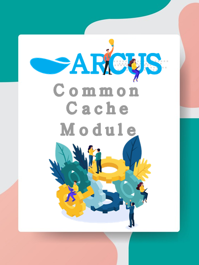
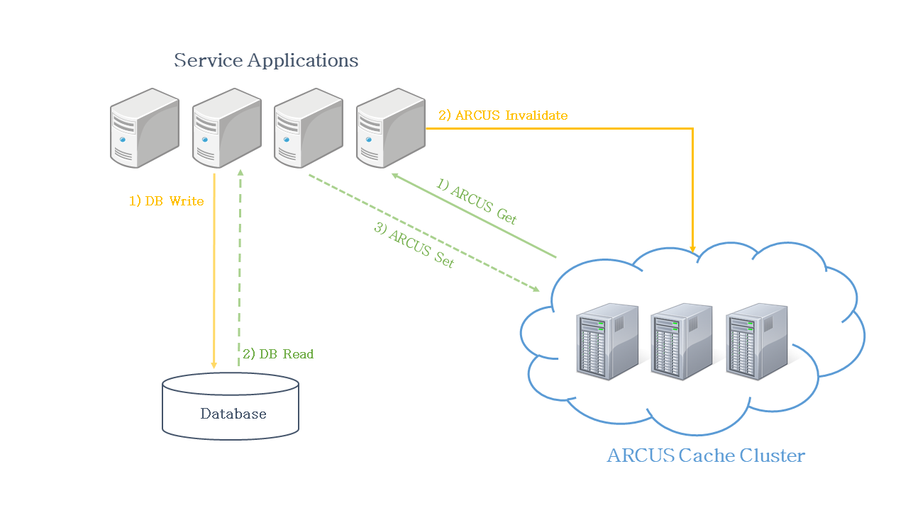

# ARCUS Common Cache Module Use with Basic Pattern Caching in Java Environment

</img>

If you are a developer who tries to apply cache to the application for the first time, you might not be able to get it done right. 
When it comes to applying cache to the application there are various caching patterns. Let’s talk about the most commonly
used — the Demand-fill caching pattern and the problems you might encounter while applying it to your application.
To solve these problems we’ll take a glimpse into Spring AOP, and lastly, I will introduce features available in the Java library
ARCUS common module using Spring AOP.

## Demand-Fill Cache

The ``Demand-fill` cache pattern is a method used to access data in a cache store first instead of the main database when an application 
requests a data inquiry. If data exists in the cache store, it’s retrieved from the cache, otherwise, data retrieved from the main database, 
stored into the cache, and after that, it has returned the data to a client.

</img>

This method is mainly used in query-specific requests and it’s done when a request is received from the server.

```
function fetch(key, ttl) {
  data = cache.read(key);
  if (!data) {
    data = database.read(key);
    cache.write(key, data, ttl);
  }
  return data;
}
```

To explain the `Demand-fill` pattern, let’s take a look at the following example of a Spring Framework application in Java that inquiries
product information.

```
@Service
class ProductService {
  private ProductDatabase database;
  ...
  // Product inquiry.
  public Product get(long id) {
    /* Retrieves the product data 
       from the database with an ID. */   
    return database.get(id);
  }
}
```
There is a `get` API in the `ProductService` class for a product inquiry and if you deliver the ID of the product that you want to 
inquiry to the `get` API of `ProductService` class, you will retrieve the product information data through the database.
In the following sample, referring to the [basic usage of the API](https://github.com/naver/arcus-java-client/blob/master/docs/02-arcus-java-client.md#arcus-client-%EA%B8%B0%EB%B3%B8-%EC%82%AC%EC%9A%A9%EB%B2%95) 
provided by [ARCUS Client](https://github.com/naver/arcus-java-client), we will cache the product information with the `Demand-fill` pattern.

```
@Service
class ProductService {
  private ProductDatabase database;
  private ArcusClient arcusClient;
  ...
  // Product inquiry.
  public Product get(long id) {
    // Generate a cache key for a specific (ID) product.
    String cacheKey = "product:" + id;
    /* Asynchronous request 
       for Get operation that inquires items to the ARCUS cache. */
    Future < Object > getFuture = client.asyncGet(cacheKey);
    
    try {
     // Waits for 700ms for request results from the ARCUS cache.
     Product product = 
       (Product) future.get(700, TimeUnit.MILLISECONDS);
       
      if (product != null) {
        // In case of a Cache Hit, return cached data.
        return product;
      }
    } catch(Exception e) {       
      /* Cancel the Get operation in cases of:
         request timeout, cache server down, or error occurrance. */
      future.cancel(true);
    }
    /* In case of a Cache Miss, 
       inquiry data from the database. */
    Product product = database.get(id);
    /* Store the product retrieved from the database in the 
       ARCUS cache with an automatic expiration time of 60sec. */
    client.set(cacheKey, 60, product);
    return product;
  }
}
```

After applying the `Demand-fill` pattern caching to one line product inquiry code, a large number of codes have been appended. 
Of course, the real data inquiry code of an application is much more complex than this sample code. Hence, with the addition of
cache logic, the complexity of code will be increased alongside the cost of the changed code test and it will increase the number
of duplicate codes as the subjects to apply cache will increase. Eventually, it will turn into a very complex and difficult code while
trying to apply a cache for query performance, leading to an increased cost of development that will be hard to maintain and focus on 
core business logic. Therefore, we need to think about how we can apply the `Demand-fill` pattern caching logic to the target APIs without 
changing the existing code.

## Spring AOP-based Caching

Spring AOP (Aspect Orient Programming) separates the common logic into different codes from the application, allowing it to focus
on the core business logic of the application. The `@Transactional` Annotation is a typical AOP concept used in many Spring applications 
for transactional processing. Oftentimes if you have a logic that needs to perform atomically many changes to the database, paste the 
`@Transactional` Annotation on the top of the corresponding API. For example, let’s consider the code of a service that transfers money 
from one account to another.

```
@Transactional
public void transferMoney(long from, long to, long amount) {
  accountDatabase.decreaseAmount(from, amount);
  accountDatabase.increaseAmount(to, amount);
}
```

If an error occurs when invoking `transferMoney` API after the amount of the from account has been deducted `(decreaseAmount)` from the 
database but the amount of the `to` account isn’t increased `(increasedAmount)`, that amount will be rolled back to the `from` account,
to its previous state. However, when a database fails, there isn’t any code to roll-back the amount of money to the account. 
The fact is, some parts of a `transferMoney` code are hidden by `@Transactional`. It’s not exactly the same as the actual code, but the 
hidden code would look like something as follows.

```
public void transferMoney(long from, long to, long amount) {
  try {
    // Beginning of the transaction.
    transactionManager.begin();
    accountDatabase.decreaseAmount(from, amount);
    accountDatabase.increaseAmount(to, amount);
    /* In case of successful remittance,
       it commints the reflection in database. */
    transactionManager.commit();
  } catch (Exception e) {
    /* In case of failure,
       it rolls back to the previous state. */
    transactionManager.rollback();
  }
}
```

The part of the code hidden for the transaction is isolated from other modules, and the isolated code will be inserted into the API
(method) where `@Transactional` pasted. In Spring AOP, there are two typical ways to insert the code into the target API. One way to do
it is to insert the code into the target class’s byte code on the compiling time and the other way is to, create the target class’s proxy 
on the runtime. For more details on this, please refer to the [Spring AOP](https://docs.spring.io/spring-framework/docs/3.0.x/reference/aop.html)‘s official documentation.

Cache logic of the `Demand-fill` pattern can also be isolated into other modules same like `@Transactional`. The question is, where do you 
define the code that needs to be inserted into the target to apply cache? Spring AOP provides `@Aspect` Annotation to modularize common 
logics of services into class forms. You can write the code that needs to be executed before, after, and when an exception occurs running 
the target API in the class granted by `@Aspect`.

```
@Component
@Aspect
class ArcusCacheAspect {
  /* 
    @Pointcut: Target setting to apply common logic
    (Annotation, Package, Class, Method, Parameter Name(s)). 
  
    @ArcusCache Annotation is alreade granted to the Servive
    class method and applying common logic to methods
    in which  return types exist. 
  */
  @Pointcut("@annotation(ArcusCache)
    && execution(public !void *Service(..))")
   
  public void pointcut() {}
  /* 
    @Around: Annotation to perform code before and after the call 
    of the target API.In below shown code in which common logic 
    is performed, jointPoint already has the signatures
    (Class, Method, Parameter, Annotation) of target API. 
  */
  @Around("pointcut()")
  public Object around(final ProceedingJoinPoint joinPoint)
    throws Throwable {
    // Target API before the call.
    System.out.println("before");
    // Calling the target API.
    Object object = joinPoint.proceed();
    // Target API after the call.
    System.out.println("after");
    // Returning the target API's data.
    return object;
  }
}
```

Let’s try to separate the cache logic using `@Aspect` in the product inquiry code, that explained earlier with the `Demand-fill`
caching method.

```
@Component
@Aspect
class ArcusCacheAspect {
  /* 
    @Pointcut: Target setting to apply common logic 
    (Annotation, Package, Class, Method, Parameter Name(s)). 
 
    @ArcusCache Annotation is alreade granted to the Servive
    class method and applying common logic to methods in 
    which return types exist.
  */  
  @Pointcut("@annotation(ArcusCache)")
  public void pointcut() {}
  /* 
    @Around: Annotation to perform code before and after 
    the call of the target API.In below shown code in which
    common logic is performed, jointPoint already has the
    signatures(Class, Method, Parameter, Annotation) of target API.
   */
  @Around("pointcut()")
  public Object around(final ProceedingJoinPoint joinPoint)
    throws Throwable {
    // Generate the cache key through target API parameter.
    String cacheKey = createArcusKeyFromJoinPoint(joinPoint); 
    /* Obtains the Expire Time
       through target API's @ArcusCache Annotation. */
    int expireTime = getExpireTimeFromJoinPoint(joinPoint);
    /* Asynchronous request 
       to Get operation of ARCUS cache items inquiry. */
    Future < Object > getFuture = client.asyncGet(cacheKey);
    try {
      // Wait for 700ms for request result from ARCUS cache.
      Object object = getFuture.get(700, TimeUnit.MILLISECONDS);
      if (object != null) {
      /* In the event of a Cache Hit, return the cached data.
         Actual code of target API(joinPoint.proceed()) not
         performed. */ 
        return object;
      }
    } catch (Exception e) {
       /* Cancel the Get Operation request in case of:
          request timeout, cache server down or error occurrance */
       getFuture.cancel(true);
    }
 
    // In case of Cache a Miss perform the target API code.
    Object object = joinPoint.proceed();
    /* Store the retrieved Object 
       from the database into ARCUS cache. */
    client.set(cacheKey, 60, object);
    // Return the data.
    return object;
  }
}
```

Now if you assign `@ArcusCache` Annotation to the target API that you want to apply cache, `around` of the `ArcusCacheAspect` class
will be called up when the target API is called, thus this way caching will be done in a `Demand-fill` pattern.


## ARCUS Common Cache Module with Basic Pattern to Help Apply Caching in Java Environment

ARCUS common cache module provides a modularized `Aspect` class that performs the cache logic of `Demand-fill` pattern. 
Therefore, without any code modification, you can simply apply the cache to the target APIs. The ARCUS Common Module has the 
following advantages over using the API directly provided by the existing Arcus Java Client.

- Allows a developer to focus on the core business logic by separating cache logic into different modules.
- Reduces development cost without any changes to existing code.
- No need to be extra familiar with the usage method of cache client API.

There are two different `Demand-fill` caching methods provides by ARCUS common cache module. One method is to assign 
the cache target API an Annotation, and another way is to specify the cache target APIs with caching attributes in the Property file.

### Annotation-based Caching

In the `get` API of previously explained product inquiry it’s possible to apply cache simply by granting `@ArcusCache`.
During the product query, if it’s a cache hit, without performing the internal code of `get` API we will return the retrieved 
data from the cache-store. In case, if the cache item cannot be retrieved due to cache server failure, it has no impact on service
behavior. Because it’s implemented to perform only the internal code of `get` API.

```
@Service
class ProductService {
  private ProductDatabase database;
  ...
  // Product inquiry through the id.
  @ArcusCache(prefix = "PRODUCT",
              expireTime = 60,
              operationTimeout = 700)
  public Product get(@ArcusCacheKey long id) {
    /* In the event of Cache Hit, 
       below code will not be performed. */
    return database.get(id);
  }
   
   // Product inquiry through the Object.
   @ArcusCache
   // use all fields of product as a cache key parameter.
   public Product get
     (@ArcusCacheKeyParameter("*") Product product) { 
     /* In case of Cache Hit, 
        below code will not be performed. */
     return database.get(producet.getId());
   }
}
```

You may have noticed a similarity with `@Cacheable` Annotation of [Spring Cache](https://docs.spring.io/spring-framework/docs/4.2.x/spring-framework-reference/html/cache.html)
if you have used it enough. [ARCUS Spring](https://github.com/naver/arcus-spring) also provides a cache implementation in order 
to support Spring Cache. Unlike `@ArcusCache`, to set cache properties (prefix, expire time, operation timeout), you must create a 
Spring Cache instance that has each cache property and specify it in the Spring Cache Annotation’s `cacheNames` property.

```
@Service
class ProductService {
  private ProductDatabase database;
  ...
  // Product inquiry
  @Cacheable(cacheNames = "product_60_ttl_cache" 
  // prefix=PRODUCT, expire time=60 */ , key = "#id")
  public Product get(long id) {
    return database.get(id);
  }
}
@Configuration
class CacheConfiguration extends CachingConfigurerSupport {
  ...
  @Bean
  public Map<String, ArcusCacheConfiguration> initialCacheConfig() {
    Map<String, ArcusCacheConfiguration> initialCacheConfig
      = new HashMap<>();
    initialCacheConfig.put("product_60_ttl_cache", 
      product60TTLCache());
    return initialCacheConfig;
  }
  @Bean
  public ArcusCacheConfiguration product60TTLCache() {
    ArcusCacheConfiguration cacheConfig = 
      new ArcusCacheConfiguration();
    cacheConfig.setPrefix("PRODUCT");
    cacheConfig.setExpireSeconds(60);
    cacheConfig.setTimeoutMilliSeconds(700);
    return cacheConfig;
  }
}
```
Because Spring Cache is designed with a focus on cache abstraction, there’s the inconvenience of setting up vendor-provided special 
attributes (e.g. prefix in ARCUS). In addition, a developer must set the Key parameter of a cache that affects the outcome.

`@ArcusCache` Annotation provided by ARCUS common cache module has the flexibility to specify the cache properties for each target APIs, 
including the feature to create the cache key by automatically setting the key parameter of cache, thus you don't have to extra worry 
about it. Nevertheless, if you want to have a cache implementation without extra code changes, using the [ARCUS Spring](https://github.com/naver/arcus-spring)
can be a good option for you.

### Property File-based Caching

It’s difficult to check cached API items at one glance if Annotation-based caching is applied. Also due to code modification 
requirements, the project needs to be rebuilt and deployed in order to grant Annotation. To that end, the ARCUS common cache module
provides the method to apply the cache by specifying the cache target APIs in a separate file. All you have to do is to create the 
`arcusCacheItems.json` file in your project and write out the cache target APIs (package + class + method name) and cache properties in JSON format.

```
/* arcusCacheItems.json */
[
  {
     "target": "com.service.ProductService.get",
      "prefix": "PRODUCT",
      "keyParams": ["id"],
      "expireTime": 60
  },
  {
      "target": "com.service.UserService.get",
      "prefix": "USER",
      "keyParams": ["user.id"],
      "expireTime": 120
  }
]
```
ARCUS common cache module provides an API for managing cache targets information details such as `arcusCacheItems.json.`
If we could do a little more here, without using the `arcusCacheItems.json` file, after importing a list of cache target from 
external storage, it is possible to add, remove targets using the cache target management API provided by ARCUS common cache module. 
In that case, there is an advantage to change the cache targets on runtime, hence you don't have to redeploy the application.

```
class CacheItemManager {
  private ArcusCacheItemManager arcusCacheItemManager;
  private Database database;
  ...
  public void updateArcusCacheItems() {
    arcusCacheItemManager.update(getArcusCacheItems());
  }
  public List <ArcusCacheItem> getArcusCacheItems() {
    return database.getArcusCacheItems();
  }
}
```

## Conclusion

So far, we’ve looked into how to apply commonly used cache pattern to the application and the features available in the ARCUS common cache 
module. If you already have experience with cache applications this might sound cliché, but in reality, when we were building ARCUS on
clients’ systems there are still many people who don’t know much about how to use the ARCUS Client. Therefore for those groups of people,
we created the ARCUS common cache module to make it easier for them to use the ARCUS in the application. For the future, we are planning
to add and optimize the following features so that the ARCUS cache application could be more easily and quickly done.

- Feature for Removing and Storing Cache Items: when a request for a database’s change occurs, provides the addition
of Annotation to update or remove cache items (e.g. @CacheEvict, @CachePut, in Spring Cache.)

- Optimization for Cache Stampede Prevention: upon cache item expiration, it’ll resolve a large number of requests to the database.

- Managing Cache Target API Changes: manage cache targets on webpages and if the cache target is changed, immediately
reflect changes without redeployment of an application.

- Cache Item Synchronization Feature: when data changes occur in the database, synchronize cache items by tracking 
the association between a database’s data and cache items.

- Collection Support: beside key-value, provide Annotation or Wrapper API of B+tree, Map, List, Set data structure.


