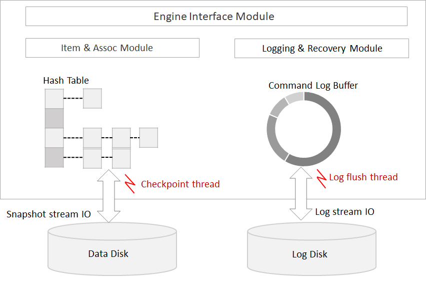

# Overview and Usage of Persistence Feature to Preserve Data Permanently in ARCUS Cache System

</img>

ARCUS in-memory cache cluster uses memory as a high-performance data storage medium for cache purposes. But as a volatile memory, 
it has the characteristic of losing all the stored data when the system shuts down for reasons such as system upgrade, system failure,
or equipment replacement, etc. Due to the need for data storage besides cache purposes, a data persistence feature was developed on
ARCUS that allows data to be preserved permanently. In this article, I will introduce you to the ARCUS Data Persistence feature and 
how to use it.

## Overview of ARCUS Persistence

ARCUS data persistence provides the ability to fully recover data using Snapshot and Command Logging methods to write cache data into
a disk. To provide data persistence, ARCUS instance has the following modules: (1) a Checkpoint module that periodically executes a 
Snapshot that writes the entire data into a disk and (2) a Command logging module that logs the command itself for a requested change 
command by ARCUS applications.

</img>

The job of a checkpoint is to write a piece at a time of an entire cache item into a disk and alongside with a separate thread,
it does not delay the process of common application requests. In the case of a change request, the worker thread for processing 
an application request has only an additional overhead of creating a command log for a change request and record it to the log buffer; 
other than that, tasks like writing from a log buffer to a log disk is executed in parallel with a separate thread. Therefore, 
ARCUS Persistence has been implemented in a way, where the worker threads can only focus on processing application requests by 
minimizing the overhead of additional persistence operations, thus ensuring high performance.

## Snapshot based Checkpoint
The purpose of a checkpoint is to reduce data recovery time. Because the data recovery time is getting longer when the command log file
grows respectively, and it reduces the size of the command log file by taking periodically a snapshot of an entire data. The main pattern
and characteristics of the checkpoint are as follows.

- A separate checkpoint thread performs.
  - Because all cache items must be searched sequentially, there may be competition with the worker threads for access to cache items.
  - To avoid interference with the processing of application requests, a snapshot was executed by repeatedly accessing only a small number of cache items at a time.
  
- Checkpoint first creates a new command log file, after that, it starts to take a snapshot in order to create a backup copy.
  - A new command log file records requests that have been changed after the current snapshot.
  - A change request is carried out in parallel even during the current snapshot process. If a change request made to the cache item, 
  that has been recorded into a disk by the current snapshot, then create a new command log file and record the changes in both new and
  existing command log files. If it’s a change request about a cache item that has not yet been snapshotted, it will be recorded in an
  existing log file but not in a new command log file.
  - Note that a command log file created by the previous checkpoint records the command log of all change requests, and that is because if the current checkpoint operation fails for some reason it still will be possible to recover from the previous snapshot file and previous command log file.

When you complete the snapshot for all cache items, a new command log file will be used to record subsequent command logs;
a previous snapshot file and a previous command log file will be removed.

## Command Logging

In the case of the change request, the worker threads that handle a request of application create and store a command log that
only necessary to re-execute the request. Command logging is implemented in the following manners to optimize logging performance.

- Use a command log buffer of a circular queue structure.
- The worker thread creates a command log and stores it in the log buffer, and a separate log flush thread is in charge of writing 
from a log buffer to the command log file.
- In the case of lookup/change of location and size of log data that needs to be written to the log file from the log buffer, 
a log flush thread competes with the worker thread, otherwise, a log flush thread executes a flush operation in parallel with the worker thread.

The following two modes of the command log are supported:

### Asynchronous logging mode

- Although the worker thread records a command log to a log buffer, complete the change operation without guaranteeing that it will
be recorded on the disk. Therefore, if the ARCUS instance terminated abnormally in the case of the command log of the completed request
without recording on the disk, data loss is certain.
- The worker thread generates a command log with taking only the burden written on the log buffer, so the difference between traditional 
cache performance is not that significant.

### Synchronous logging mode

- The worker thread records a command log to a log buffer and after verifying it was recorded on the disk, it completes the change 
operation. Therefore, even if the ARCUS instance terminated abnormally, it has the advantage of being able to fully recover the data without any loss.
- To achieve optimal performance in synchronous logging mode, the task to flush the log data to the disk is executed by a separate
log flush thread. In the meantime, the worker threads can handle requests of other clients as well. Therefore, even in synchronous
logging mode, it’s possible to achieve a significant level of performance.

## ARCUS Persistence Usage

Added up a persistence feature to the ARCUS `default` cache engine, I’ll give you a brief introduction on how to use ARCUS Persistence
in the CestOS environment. In the below explanation we will run only one ARCUS cache node with the `default` engine.

### Persistence Configuration
The `default` engine in the ARCUS has a `default_engine.conf` file with settings for engine operation. In that file, you can make the 
following Persistence-related configurations.

```
# Persistence configuration
# use persistence (true or false, default: false)
use_persistence=true

# The path of the snapshot file (default: ARCUS-DB) data_path=/home/test/arcus/ARCUS-DB
# The path of the command log file (default: ARCUS-DB)
logs_path=/home/test/arcus/ARCUS-DB

# asynchronous logging
async_logging=false

# checkpoint interval (unit: percentage, default: 100)
# The ratio of the command log file size to the snapshot file size.
# 100 means checkpoint if snapshot file size is 10GB, command log file size is 20GB or more
chkpt_interval_pct_snapshot=100

# checkpoint interval minimum file size (unit: MB, default: 256) chkpt_interval_min_logsize=256
```

Persistence configuration items are described below.
- **use_persistence**
  - persistence availability setting (`enable` || `disable`).
  
- **data_path, logs_path**
  - `data_path` and `logs_path` are the paths where the `snapshot` and `command log` files are created respectively.
  - Both paths must be specified, and both paths can be the same. If it's possible an absolute path specification is recommended.

- **asynchronous logging**
  - Settings of the behavior mode of command logging.
  - It will operate in synchronous logging mode if its `false`, if its `true` then in asynchronous logging mode.

- **chkpt_interval_pct_snapshot**
  - With the checkpoint execution interval configuration set the additionally increased size ratio of the command log file, 
  in contrast, to snapshot file size.
  - Execute a checkpoint when the command log file becomes larger, same as a specified ratio. For example, if you set it to 100
  and the snapshot file is 10GB, then it will be able to execute a checkpoint when a command log file will grow extra by 100 % to 20GB.

- **chkpt_interval_min_logsize**
  - With the checkpoint execute interval configuration it will be able to execute a checkpoint, only if the command log file 
  is greater than the specified minimum size.
  - To prevent frequent checkpoint execution if the snapshot file is small.

## Download

Download the source code from the [Github arcus-memcached](https://github.com/naver/arcus-memcached) repository.

```
$ git clone https://github.com/naver/arcus-memcached.git
```

## Compile

In order to use the Persistence feature, you must first add the `--enable-persistence` option to the configuration then compile it.
FYI `--prefix` option specifies the location of `make install`.

```
$ ./config/autorun.sh
$ ./configure --prefix=/home/test/arcus --enable-persistence
$ make
$ make install
```

When you complete the `make install`, files required to run the ARCUS instance on the installation path specified
with `--prefix` are created in the following directories:

- bin : ARCUS instance `memcached` binary start
- conf : `default` engine configuration file `default_engine.conf`
- lib : `defaul`t engine library `default_engine.so`, ARCUS instance’s logger library `syslog_logger.so`

## ARCUS Instance Initialization

Before starting the ARCUS instance, create the directory where the snapshot file and the command log file will be created and 
set the aforementioned setting file of the default engine.

Navigate to the `bin` directory of the installation path and start the ARCUS instance. With `-E` option location of the 
`default` engine’s library, and with `-e` option location of the `default` engine’s setting file specified in the absolute path as follows:

```
./memcached -d -v -r -p 11500 -m 500 \
-X /home/test/arcus/lib/syslog_logger.so \
-E /home/test/arcus/lib/default_engine.so \
-e config_file=/home/test/arcus/conf/default_engine.conf
```

Because `syslog_logger.so` was used when running the ARCUS instance, you can check the initialization message in `syslog`.
The initialization message of persistence-related modules must be displayed as shown below.

```
Dec 11 15:15:18 jam2in memcached[1221]: CMDLOG FILE module initialized.
Dec 11 15:15:18 jam2in memcached[1221]: CMDLOG BUFFER module initialized.
Dec 11 15:15:18 jam2in memcached[1221]: COMMNAD LOG RECORD module initialized.
Dec 11 15:15:18 jam2in memcached[1221]: SNAPSHOT module initialized.
Dec 11 15:15:18 jam2in memcached[1221]: CHECKPOINT module initialized.
Dec 11 15:15:18 jam2in memcached[1221]: There are no files needed for recovery. Do checkpoint to create checkpoint file set.
Dec 11 15:15:18 jam2in memcached[1221]: Done the snapshot action.
Dec 11 15:15:18 jam2in memcached[1221]: Group commit thread started.
Dec 11 15:15:18 jam2in memcached[1221]: Command log flush thread started.
Dec 11 15:15:18 jam2in memcached[1221]: Checkpoint thread started.
Dec 11 15:15:18 jam2in memcached[1221]: COMMAND LOG MANAGER module initialized.
```

After initializing the ARCUS instance you can see that snapshot and command log files have been created. If you run the ARCUS instance without a snapshot
file, execute a checkpoint in the initializing process, and in this way, it will create empty snapshot and empty command log files.

```
[test@jam2in:ARCUS-DB *]$ ls -l
-rw-r — — — 1 test test  0 Dec 11 15:15 cmdlog_20201210174619
-rw-r — — — 1 test test 48 Dec 11 15:15 snapshot_20201210174619
```

## ARCUS Command Execution using Telnet

Using a `telnet` command I will connect to the ARCUS instance on the port `11500` in the `localhost` and send requests to ARCUS. 
At first, we will create the KV and BTree items, then we’ll insert two elements in the BTree item. For a detailed description of the
ARCUS ASCII command please refer to the [ARCUS DOCS system](https://www.jam2in.com/arcus-docs/).

`Note:` the current ARCUS documentation system is available in the Korean language only. But you can use [papago.naver.com](https://papago.naver.com/) for general translation.

```
telnet localhost 11500
Trying ::1…
Connected to localhost.
Escape character is ‘^]’.
set kvkey 0 0 3
qwe
STORED
bop create btreekey 0 0 3
CREATED
bop insert btreekey 10 3
qwe
STORED
bop insert btreekey 11 3
ewq
STORED
```

Now, let's check the stored items and elements.

```
telnet localhost 11500
Trying ::1…
Connected to localhost.
Escape character is ‘^]’.
get kvkey
VALUE kvkey 0 3
qwe
END
bop get btreekey 10
VALUE 0 1
10 3 qwe
END
bop get btreekey 11
VALUE 0 1
11 3 ewq
END
```

The current command log mode is specified as `async_logging=false` in the engine configuration file, and as soon as a command
is requested in the synchronous mode it will be recorded in the command log. By checking the size and data of the command log file 
in the command log directory(`logs_path`), you can see that the aforementioned command is recorded.

## ARCUS Command Bulk Execution using Memtier_Benchmark

This time let's try Traffic Generation Tool `memtier_benchmark` and send a large number of requests to the ARCUS instance. In this case,
we will make sure that checkpoint execution conditions are met and well-executed. Please refer to the [Github repository](https://github.com/RedisLabs/memtier_benchmark) 
for `memtier_benchmark` installation instructions and usage guide.

Set the `memtier_benchmark` initialization parameters as shown below. I will insert 300K items each consisting of 1KB data into the 
ARCUS instance. Hence, a total of 300MB of data will be inserted.

```
./memtier_benchmark -s 127.0.0.1 -p 11500 --threads=10 \
--clients=10 --requests=3000 --protocol=memcache_text \
--data-size=1024 --key-minimum=1 --key-maximum=300000 \
--key-pattern=P:P --ratio=1:0
```

- `--key-minimum`, `--key-maximum` : a key range of the inserted items is 1 to 300,000, with a total insertion of 300,000 items.
- `--data-size` : a value size of the inserted item is 1KB
- `--key-pattern=P:P`  : parallel process request, handled by dividing the range of keys by connection
- `--ratio=1:0 `: in terms of `Set:Get` ratio, set 1:0 to request the Set command only.

To execute a checkpoint, according to the checkpoint execution conditions that already set in the engine configuration file,
the size of the command log file has to meet all the conditions listed below.

- `chkpt_interval_pct_snapshot=100`
  - The size of the snapshot file of the last checkpoint (checkpoint that executed during the initialization) must be more than 
  96 bytes by being additionally 100% increased from 48 bytes.
 
- `chkpt_interval_min_logsize=256`
  - Minimum 256MB or more
  
Therefore, a checkpoint is executed when the command log file size is more than 256MB, forthwith you can check the log message 
of the checkpoint in `syslog`.
  
```
Dec 11 15:21:01 jam2in memcached[1221]: Checkpoint started.
```

As I mentioned earlier if you check out the `data_path` and `log_path` closely, you can see the snapshot and command log files have
been created when the checkpoint thread executes the snapshot.

```
[test@jam2in:ARCUS-DB *]$ ls -lh
-rw-r — — — 1 test test 270M Dec 11 15:15 cmdlog_20201211151519
-rw-r — — — 1 test test    0 Dec 11 15:21 cmdlog_20201211152101
-rw-r — — — 1 test test   48 Dec 11 15:15 snapshot_20201211151519
-rw-r — — — 1 test test 2.8M Dec 11 15:21 snapshot_20201211152101
```

when you complete the checkpoint, a log message about completion will be displayed as shown below,

```
Dec 11 15:21:01 jam2in memcached[1221]: Done the snapshot action.
Dec 11 15:21:01 jam2in memcached[1221]: Checkpoint has been done.
```

you can also verify that the previous snapshot file and previous command log file have been removed.

```
[test@jam2in:ARCUS-DB *]$ ls -lh
-rw-r — — — 1 test test   40 Dec 11 15:22 cmdlog_20201211152203
-rw-r — — — 1 test test 307M Dec 11 15:21 snapshot_20201211152101
```

We inserted a total of 300,000 items by using the `memtier_benchmark`. Now let’s check the total number of items stored in ARCUS. 
If you request the `stats` command from `telnet` you can check the `curr_items values`. Including the two items inserted earlier with 
`ARCUS command using Telnet`, there will be a total of 300,002 items stored at the moment. If there were more stored items, that will 
be because ARCUS internally has made the item insertion request to detect the Hang. For the record, internally requested commands are 
not recorded in the command log file.

```
STAT curr_items 300002
```

## Recovery Verification After Restart of ARCUS Instance

Let’s check if the data will be preserved after you restart the ARCUS instance. First, let's shut down the ARCUS instance,

```
kill $arcus-memcached_pid
```

and, restart it with the same options.

```
./memcached -d -v -r -p 11500 -m 500 \
-X /home/test/arcus/lib/syslog_logger.so \
-E /home/test/arcus/lib/default_engine.so \
-e config_file=/home/test/arcus/conf/default_engine.conf
```

When you will restart it, the ARCUS instance will by itself check the log message to recover the data using the snapshot 
and command log files in `data_path` and `log_path` as shown below.

```
…
Dec 11 15:23:18 jam2in memcached[1333]: Check that ARCUS-DB/snapshot_20201211152101 is valid snapshot file for recovery.
Dec 11 15:23:18 jam2in memcached[1333]: [RECOVERY — SNAPSHOT] applying snapshot file. path=/home/test/arcus/ARCUS-DB/snapshot_20201211152101
Dec 11 15:23:18 jam2in memcached[1333]: [RECOVERY — SNAPSHOT] success.
Dec 11 15:23:18 jam2in memcached[1333]: [RECOVERY — CMDLOG] applying command log file. path=/home/test/arcus/ARCUS-DB/cmdlog_20201211152203
Dec 11 15:23:18 jam2in memcached[1333]: [RECOVERY — CMDLOG] success.
Dec 11 15:23:18 jam2in memcached[1333]: Group commit thread started.
…
```

Before termination, if you perform the `ARCUS command using Telnet` to request a lookup for the data that have been inserted,
you can verify that data have been recovered as it was before.

```
telnet localhost 11500
Trying ::1…
Connected to localhost.
Escape character is ‘^]’.
get kvkey
VALUE kvkey 0 3
qwe
END
bop get btreekey 10
VALUE 0 1
10 3 qwe
END
bop get btreekey 11
VALUE 0 1
11 3 ewq
END
```

If you request the `stats` command from `telnet` to check the `curr_items` before termination, you can see the total number of stored 
items is the same as the `bulk execution of ARCUS command using the Memtier_benchmark`.

```
STAT curr_items 300002
```

## Conclusion

In summary, I have introduced and explained the basic usage of the data persistence feature of the ARCUS cache system provided 
by snapshot-based checkpoint and command logging. Data persistence is a very important technology that can expand not just cache 
purpose usage but also storage purpose as well. Currently, operation and basic testing for ARCUS Persistence have been completed, 
and in the future, the following works will be processed.

- Ability to change persistence settings dynamically,
- Continuous testing and improvement in multiple workloads.

The ARCUS Persistence that has been discussed in this article, is designed to minimize the impact of an application request 
process and doesn’t have a significant performance difference from an original ARCUS cache. Next time, we will measure performance
differences between the cache and storage in command logging mode.


