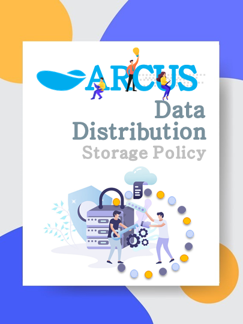
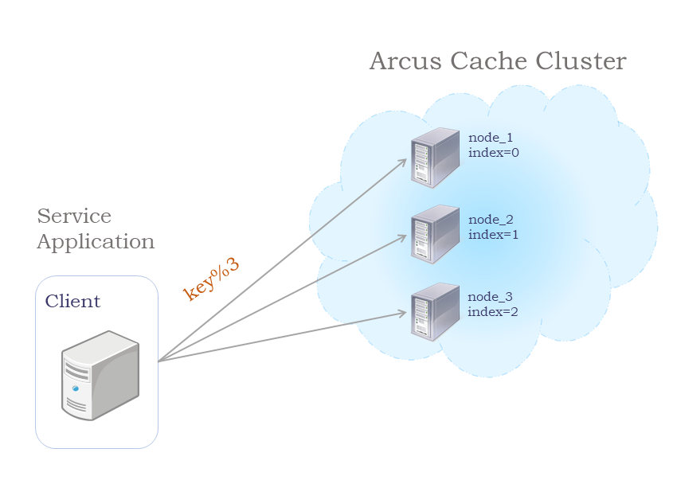
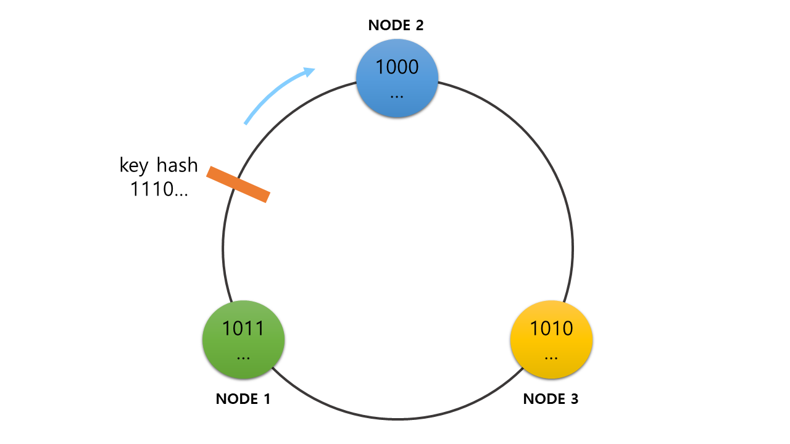
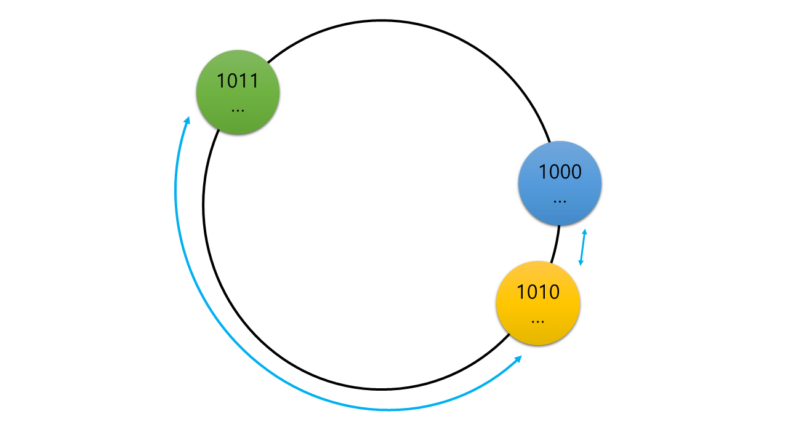
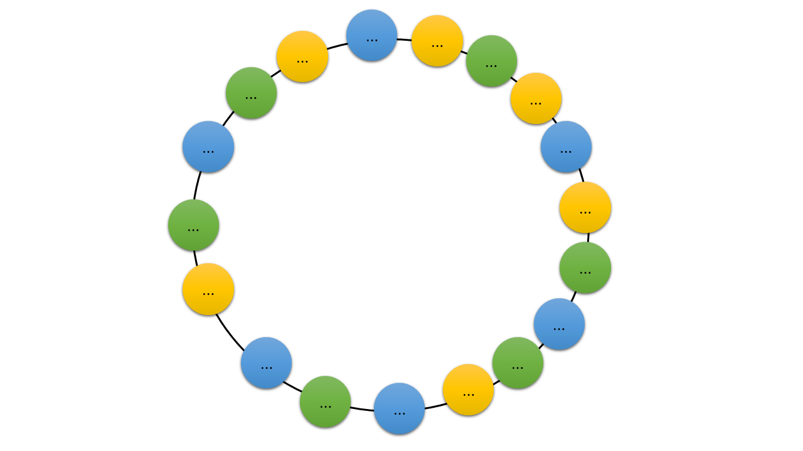

# ARCUS Data Distribution Storage Policy

</img>

When performance issues occur during service operations due to heavy load, we tend to solve these problems with scale-up and scale-out. Scale-up is simply replacing the server’s hardware with something better. Even it’s the simplest solution, there is a limitation on performance growth and the need to restart the service. Scale-out, on the other hand, compared to scale-up has the advantage of increasing computing power in parallel, allowing continuous scaling, but the additional need to establish a distributed architecture and policies increases complexity. ARCUS supports scale-out through the cluster feature, and by doing so, it enables distributed storage of service requests and distributes the loads. This article introduces architectures and policies that you can choose when storing distributed data and how ARCUS distributes and stores data.

## Data Distribution Architecture

In general, when storing distributed data, the distributed architecture that you can consider is divided into `shared everything` and 
`shared nothing` architectures, depending on whether the data are shared between nodes.

### Shared everything

 - It has a structure of nodes that forms a cluster that shares all data.
 - It does not lose the data in the event of a node failure, because no matter which node in the cluster fails, other nodes have access to the same data.
 - It has a performance degradation due to `lock` contention and a lot of complexity in implementation.

### Shared nothing

 - It has a structure where the nodes in the cluster split data and store it.
 - According to the data distribution policy each node is responsible to store part of the data. There is no need for a `lock` 
   since it doesn't share data, thus no performance degradation.
 - When a node fails, data that the node is responsible for can be lost.
 - There's a need to establish additional data distribution policy on how to distribute and store data across each node.

Among the introduced architectures ARCUS uses a `shared-nothing` distributed architecture. It fits well with the characteristics of cache solution where performance is important and easy to implement. Due to the nature of the shared-nothing architecture, some of the data may be lost in the event of a cache node failure, but the service will continue operation with other cache nodes in the cluster. Even if a cache miss occurs when data is lost, the original data is usually stored in the database, hence the cache can be recovered immediately.

## Data Distribution Policies in Shared Nothing Architecture

When you adopt a `shared-nothing` architecture you have to think about how you can distribute and store data. 
Before you set data distribution policies you have to consider the following condition.

 - How much data do we need to relocate, when the list of cluster nodes changes due to the addition or removal of nodes?
 - Are the data uniformly distributed across the nodes?

From now on, I will introduce three data distribution policies that are mainly used in key-value stores.

### 1. Data Distribution Policy with Modulo

The easiest data distribution policy to think about when storing distributed data is the policy that distributes data using the remaining — modulo operation. In this policy, the data key is divided by the total number of nodes and the remaining value becomes the index value to select the node to store. Despite this is the simplest and easiest form of distribution policy to understand, there is a problem when it comes to relocating all stored data if the total number of nodes changes because of an addition or removal of a node.

</img>

### 2. Consistent hashing

The consistent hashing method uses the hash function to obtain a hash value from the data’s key and selects a node to store the data. Let’s suppose we have a virtual circle that places the hash value. Typically, this circle is called a hash ring. First, place the hash values obtained by hashing the names of the nodes in the hash ring. Then when all nodes are positioned in the hash ring, the data key that you want to store is hashed and similarly, it locates its hash value in the hash ring. Moving clockwise, the node closest to the data’s hash value location becomes the node that stores this data.

</img>

Therefore, when the data is distributed by the hashing method, even if the total number of nodes changed when nodes are added or removed to/from the cluster, only the `'1/total number of nodes'` amount of data is relocated. Compared to modulo this will cause very few relocations. However, nodes may not be evenly distributed across the hash ring, since the size of the area that nodes are responsible for can be different.

</img>

### 3. Ketama consistent hashing

Ketama consistent hashing resolves the downside of general Consistent hashing. Same as Consistent hashing, it forms a hash ring with hash values to distribute data. But unlike Consistent hashing that has one hash value per node, Ketama is characterized by one node having `N` hash values. If each node creates as many virtual nodes as `N` and gets hash values, the hash ring will be filled with the hash values of nodes. In this case, you will have a distributed algorithm that evenly distributes data, since the areas of the nodes in the hash ring will be in some uniformity.

</img>

## ARCUS Data Distribution Policy

Among the distribution policies that I have introduced earlier ARCUS uses the **Ketama consistent hashing** policy. Now let’s take a closer look at the algorithm that ARCUS uses to configure a hash ring. ARCUS servers and client libraries generate a hash ring once they get a list of the nodes in the cluster from ZooKeeper. First for each cache node, by repeating the process of adding a number that starts at 1 and increases in each turn at the end of the name of the cache node (using a `IP: Port` string as a node name), we create 40 (by `default`) virtual nodes. Then, by hashing each virtual node name with the md5 hash function that shows good performance, we generate a 128 bits hash value and by dividing it we get four 32 bits hash values. Thereby when the hash values of a cache node created as explained before, it generates `'40 virtual nodes ✕ 4 hash values per virtual node = total 160 hash values'` and takes a part in the hash ring with those values.

```
ip:port + repetition = 10.0.0.1:11211-1
HashAlgorithm.md5(10.0.0.1:11211-1)

Divide equally the md5 result - 128 bits into four equal part (32 bits per each).

11110000101000000101000000000000
10101010101010101010101010100101
10101010101010101010101010100101
10101010101010101010101010100101

Divide again those divided four equal part into four parts itself, reverse it, and then use it.

<11110000> 101000000 <10100000> 0000000                                             
00000000 <01010000> 10100000 <11110000>

By this way, you get four 32 bits hash values for each repetition.
Since ARCUS have 40 repetition values, a total of 160 hash values can be obtained for one node.
```

The actual code used by the ARCUS Java Client is as follows.

```
for (int i = 0; i < config.getNodeRepetitions() / 4; i++) {
 byte[] digest =   HashAlgorithm.computeMd5(getSocketAddressForNode(node) + "-" + i);
 for (int h = 0; h < 4; h++) {
   Long k = ((long) (digest[3 + h * 4] & 0xFF) << 24)
           | ((long) (digest[2 + h * 4] & 0xFF) << 16)
           | ((long) (digest[1 + h * 4] & 0xFF) << 8)
           | (digest[h * 4] & 0xFF);   
   ketamaNodes.put(k, node);
 }
}
```

Once you’ve placed the hash values of the nodes in the hash ring (as I already mentioned earlier on Ketama consistent hashing) when you need to store some data it will find the node that’s responsible for the key in the hash ring which is generated as a result of hashing a data key. One thing you need to be cautious about is **hash collisions** caused by the countless hash values generated when the number of nodes in the cluster increases. If ARCUS encounters this issue, it sorts node names alphabetically and ensures that a preceding cache node occupies that hash point. Also, as I already mentioned if you use Ketama consistent hashing when a change occurs in the server list, as many as `'change node count/ total node count'` of cache data will be relocated, which may cause a `stale data`. ARCUS has a `scrub stale` feature that deletes these `stale data`. For detailed information about `stale data`, please refer to the ["Significance Of Fault Tolerance In The Cache System and How to Provide It"](https://medium.com/jam2in/significance-of-fault-tolerance-in-the-cache-system-and-how-to-provide-it-ea83258b0d32).

## Conclusion

In summary, I have introduced and explained the architectures and policies used as distributed storage methods and how ARCUS is distributing and storing data. Currently, ARCUS does not move cache data on its own, hence if changes occur in the node list, data relocation may result in a cache miss. Therefore we need to take precautions in case of node failure to prevent this kind of cache miss. In order to do this, cache data *replication* and cache data *migration* features are required. ARCUS already provides a *replication* feature in the enterprise version and a *migration* feature for cache data migration when cache nodes join or leave cluster soon will be released.


