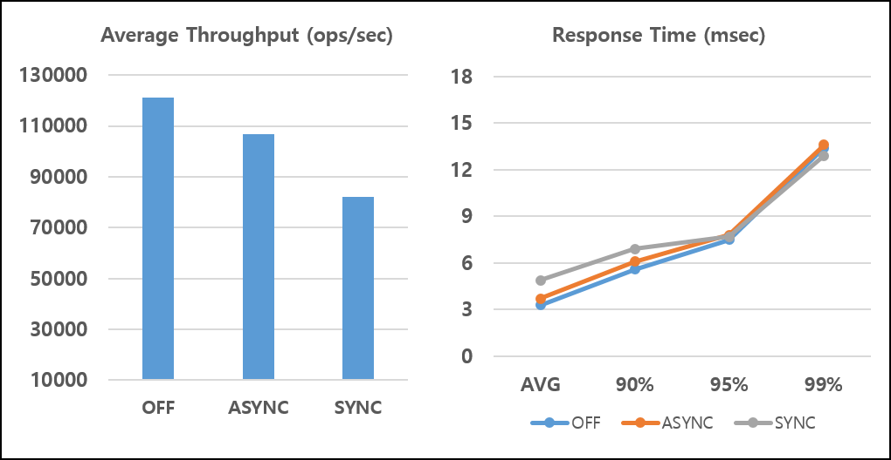
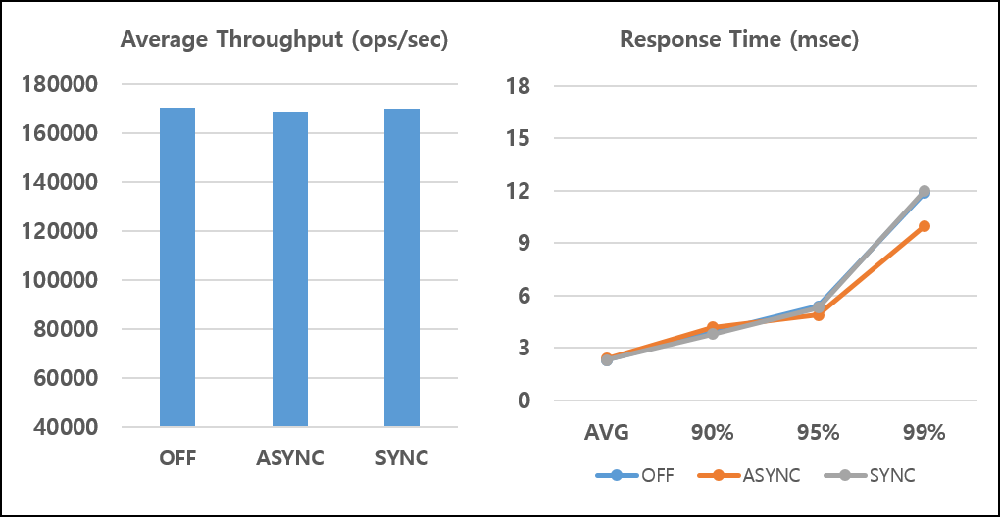
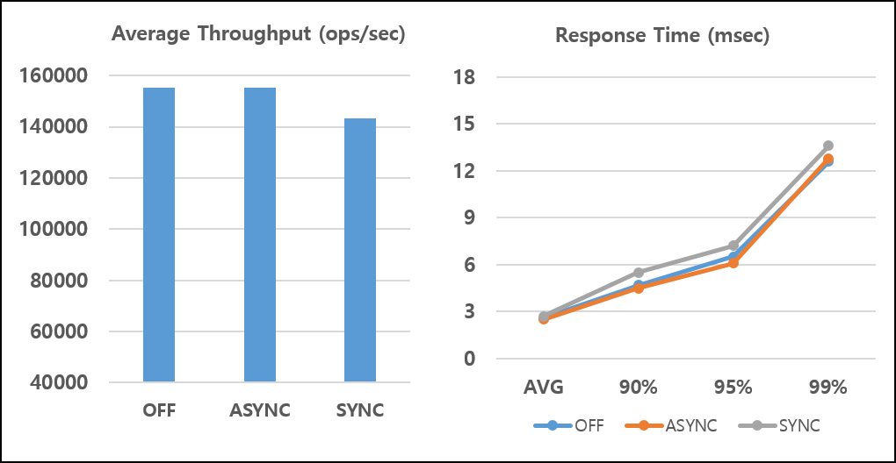
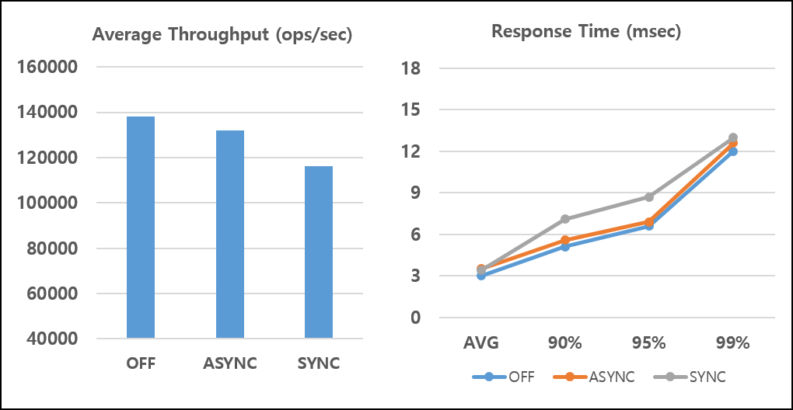
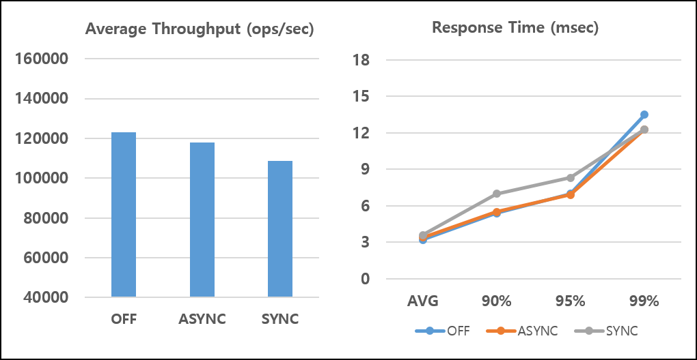
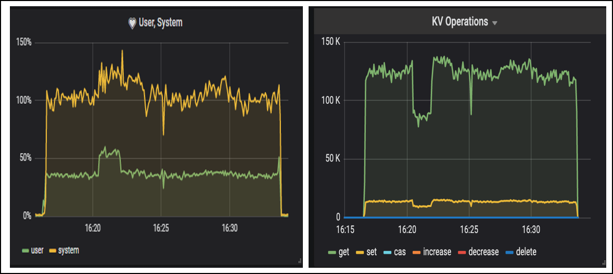

# Performance Test of ARCUS Data Persistence

</img

In the previous blog, [Overview and Usage of Persistence Feature to Preserve Data Permanently in ARCUS Cache System](https://github.com/jam2in/arcus-works/blob/master/techblog/202012_arcus_persistence_english.md),
I have introduced ARCUS Persistence and showed you essential ways to send requests to it with telnet and memtier_benchmark tools. As I have mentioned in the previous blog, ARCUS Persistence has been implemented
to guarantee high performance by minimizing the overhead of a data persistence feature so that there would be no significant difference from the performance of
ARCUS Cache. In this article, we will compare the performances of the ARCUS Persistence to the original ARCUS caching and show the results of performance differences
according to the Command Logging mode.

## Test Environment

Performance test of ARCUS Persistence will be measured in accordance with establishing the following environmental requirements.

## Test Machine Specs

Below listed specifications of a system on which the ARCUS Cache node runs. In this performance test, we have used only a single ARCUS node.

- OS : CentOS 7.3.1611
- CPU : 8vCPU
- MEMORY : 8GB * 2
- NETWORK : 1Gbps
- DISK : HDD 50GB * 2
- ETC :
  - THP(Transparent Huge Pages) = madvise
  - vm.swapiness = 30

Below listed specifications of a system on which the client that generates the load runs.

- OS : CentOS 7.3.1611
- CPU : 8vCPU
- MEMORY : 8GB * 2
- NETWORK : 1Gbps
- DISK : SSD 50GB

## ARCUS Server Running Options

The ARCUS Cache node that we have use runs on `arcus-memcached 1.13.1` and a start command is as follows:

```
memcached -d -v -r -R 100 -t 6 -p 11500 -b 8192 -c 4096 -m 12000 \
-z localhost:2150 \
-X /home/test/arcus/lib/syslog_logger.so \
-E /home/test/arcus/lib/default_engine.so \
-e config_file=/home/test/arcus/conf/default_engine.conf
```

Considering the client load, the below-shown running options must be set properly.

- `t` : number of worker threads
- `R` : maximum number of requests per event
- `b` : TCP backlog queue size
- `c` : maximum number of clients that can be connected
- `m` : maximum storage capacity (MB)

## ARCUS Persistence Settings

In the `default_engine.conf` file that has the settings for ARCUS `default` engine operation, Persistence related settings also have been set as shown in the below sample.
You can check the details of the Persistence setting in the [Overview and Usage of Persistence Feature to Preserve Data Permanently in ARCUS Cache System](https://github.com/gadimli93/tech-blog/blob/main/202012_arcus_persistence.md).
Therefore, here I will only show you the values to be set according to each test case.

```
# Persistence configuration
#
# use persistence (true or false, default: false)
use_persistence=true
#
# The path of the snapshot file (default: ARCUS-DB)
data_path=/disk2/test/arcus/ARCUS-DB
#
# The path of the command log file (default: ARCUS-DB)
logs_path=/home/test/arcus/ARCUS-DB
#
# asynchronous logging
async_logging=false
#
# checkpoint interval (unit: percentage, default: 100)
# The ratio of the command log file size to the snapshot file size.
# 100 means checkpoint if snapshot file size is 10GB, command log 
# file size is 20GB or more
chkpt_interval_pct_snapshot=100
#
# checkpoint interval minimum file size (unit: MB, default: 256)
chkpt_interval_min_logsize=256
```

- use_persistence
  - Set to `true` if you test ARCUS for storage purposes and if you test ARCUS for cache purposes set it to `false`.

- data_path, logs_path
  - **We recommend that you set the data file and the log file paths to separate disk partition.**
  -  This is because the snapshot of the checkpoint spends all IO resources of a disk, thus delaying command logging by worker threads that process client requests.

- async_logging
  - Set `true` for asynchronous logging test, `false` for synchronous logging test.

- `chkpt_interval_pct_snapshot`, `chkpt_interval_min_logsize`
  - We used a `default` value.

### Performance Measurement Tools

We used `memtier_benchmark 1.3.0` version to generate loads and measure performance. By supporting Memcached protocols we can perform insert (`set`) and retrieval (`get`)
operations of the ARCUS KV commands. You can also generate keys in a uniform or Gaussian distribution and check the average throughput per second and the 
average/tail response time.

### ARCUS Monitoring Tools

Hubble is the ARCUS Enterprise monitoring tool. Hubble collects the statistical information of an ARCUS instance and system resources of the host machine and
 shows them visually in a web browser. So we can easily observe ARCUS and system status through Hubble.

## Performance Test Scenario

### Comparison of Test Items

Performance variables to be checked and compared in this test.

- Throughput - Average throughput
- Latency - Average response time, a tail response time (90%, 95%, 99%)

### Generate test data

Test data has been automatically generated by the `memtier_benchmark`.

- Total data count: 50 million (6.5GB)
  - Key size: 9~17Bytes (“memtier-1” ~ “memtier-50000000”)
  - Data size : 50 Bytes
  - Item size : Average 130 Bytes (total key, data, metadata)

### Test Scenario and Procedure
For the performance test below, we will be measuring the performance of a cache mode, asynchronous logging mode, and synchronous logging mode with the `memtier_benchmark`. 
In these retrieval and update performance tests, we will generate keys only in a **uniform distribution**. The reason is in ARCUS entire data resides in memory,
hence both uniform and Gaussian distributions will show the same performance results.

- Performance Test of Insert
  - Insert 50 million data,
  - Execution command:

```
memtier_benchmark --threads=8 --clients=50 --data-size=50 \
--key-pattern=P:P --key-minimum=1 --key-maximum=50000000 \
--ratio=1:0 --requests=125000 --print-percentiles=90,95,99
```

- Performance test of Retrieval
  - After inserting 50 million data, generate keys in a uniform distribution and retrieve.
  - Execution command

```
memtier_benchmark --threads=8 --clients=50 --data-size=50 \
--key-pattern=R:R --key-minimum=1 --key-maximum=50000000 \
--distinct-client-seed --randomize --ratio=0:1 --requests=125000 \
--print-percentiles=90,95,99
```

- Performance tests of Mixed Update and Retrieval
  - After inserting 50 million data, generate keys in a uniform distribution. Insert and retieve at the ratio of 1:9, 3:7, and 5:5.
  - Execution command

```
memtier_benchmark --threads=8 --clients=50 --data-size=50 \
--key-pattern=R:R --key-minimum=1 --key-maximum=50000000 \
--distinct-client-seed --randomize --ratio=1:9 --requests=125000 \
--print-percentiles=90,95,99
```

### Performance Test Results

Average throughput and average/tail response time have been organized according to persistence mode.

- `OFF` is original cache performance,
- `ASYNC` is asynchronous command logging mode,
- `SYNC` is synchronous command logging mode.

### Insert Operation

The performance test result of 50 million data insert operation is as follows:

</img>

The ARCUS Persistence performance was distinctly shown since all client requests consist of the insert operation. The result shows that the performance degradation
associated with the persistence usage is not that great even compared to the original cache performance when it’s not used. Especially, synchronous logging mode
completes *update operation’s* execution after verifying that worker threads recorded a command log onto a disk so that data can be fully recovered even if the
ARCUS instance terminated abnormally at any point in time. The reason for such a high-performance result is that the worker threads have been implemented in
a way that they can handle requests from other clients during the command log is being flushed to a disk by flush daemon thread.

### Retrieval Operation

The performance test result of retrieving 50 million data in uniform distribution is as follows:

</img>

In the case of retrieval operations, command logging wasn’t executed, because there wasn’t any insert request.
Thus, even if persistence mode would be used it will have the same performance results as an ARCUS cache.

### Mixed Operation

The performance test result of mixed Update and Retrieval at a ratio of `1:9` is as follows:

</img>

The performance test result of mixed Update and Retrieval at a ratio of `3:7` is as follows:

</img>

The performance test result of mixed of Update and Retrieval at a ratio of `5:5` is as follows:

</img>

As you can see, even in the mixed operation’s performance there are no big differences with the persistence usage. Especially, because of the nature of the ARCUS 
system implementation, it has shown very good results on the performance of retrieval operation. The higher the volume of retrieval requests, the higher the
performance regardless of whether the persistence mode is used or not. In the case of Update and Retrieval at a ratio of `1:9`, the request throughput of synchronous
logging mode(SYNC) differs only about 20K from the request throughput of the original ARCUS Cache(OFF).
 
### Checkpoint Impact

Additionally, to verify the changes in request throughput of ARCUS instance during a checkpoint, we’ll show you the User/System CPU usage of an ARCUS 
host machine and the request throughput of ARCUS instance observed by Hubble.
 
*P.S. Besides the below shown information, Hubble provides many other stats (network, disk, operation hit/miss, etc.) for analysis. But for now, we leave them out.*

</img>

The above image shows the result of the performance test of a mixed operation of Update and Retrieval at a ratio of `1:9`, operating in asynchronous logging mode
with 50 million data insertion. The average throughput is about 150K combined with a throughput of update(yellow) and a throughput of retrieval(green). 
The time between `16:21` and `16:23` shows the checkpoint execution period. During that time throughput is temporarily reduced, and about 5GB was recorded to the snapshot file.
**As a future plan, we’re planning to slow down the checkpoint process further reducing the throughput degradation.**

## Conclusion

In this blog article, we have measured the performance difference of ARCUS Persistence according to command logging mode and the ARCUS Cache. As mentioned earlier, 
ARCUS Persistence was implemented to minimize the impact on the process of client requests, thus there isn’t any significant performance difference from the ARCUS cache. 
**Especially, most real service workload patterns are a mixture of insert and retrieval operations, that have a high volume of retrieves, and our mixed operation test results
showed a notably higher performance.** The disk of this test environment is a default `HDD` provided by Naver Cloud Platform’s VM. If you use the `NVMe SSD` that provides high IOPs
you can obtain a higher ARCUS performance. ARCUS Persistence is a good choice for most applications to ensure high performance where data preservation is required and 
smooth serviceability. We are continuously working on ARCUS Persistence optimization, trying to improve throughput, response time, and ease of use from an operational
perspective.

Lastly, as a precaution for a use of ARCUS Persistence, because a checkpoint operation of ARCUS Persistence records the entire data from a memory to a disk,
many disk IO resources will be used, which may delay command logging for the update operation. **Therefore, disk partitioning between data files and log files is
essential, in order to obtain high performance of ARCUS Persistence.**

