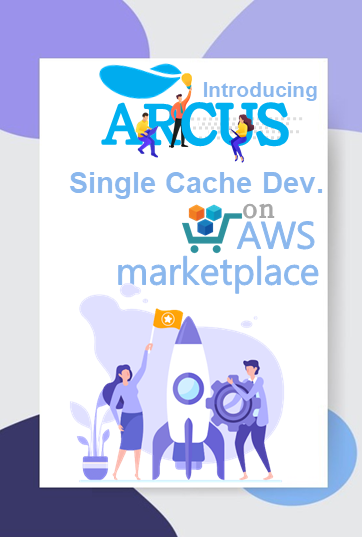
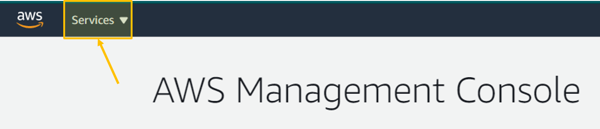
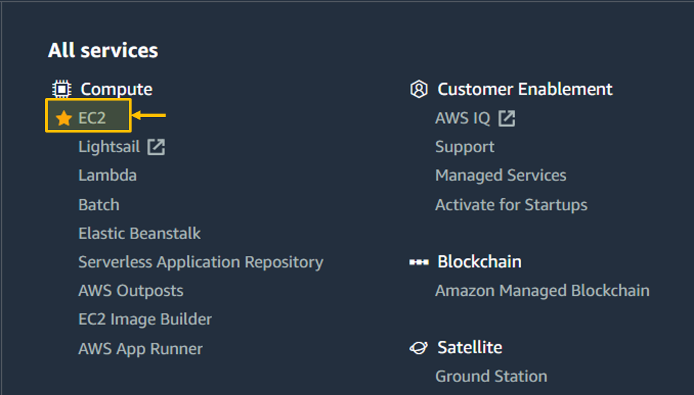
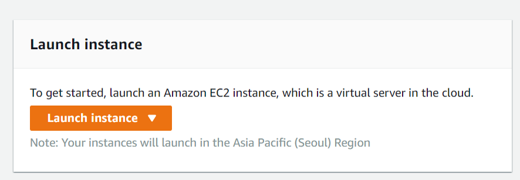
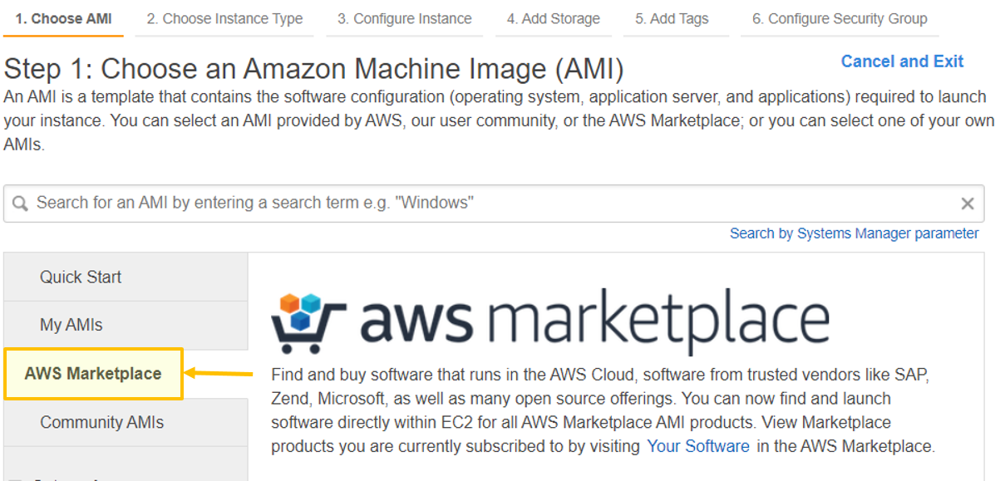
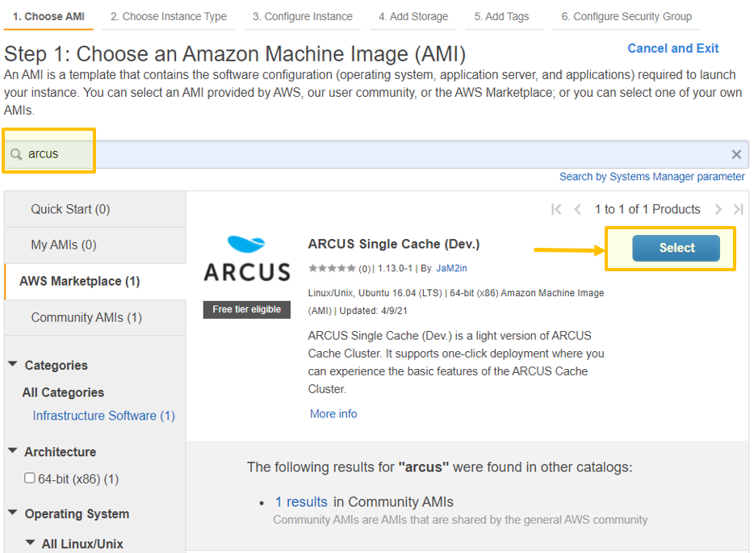
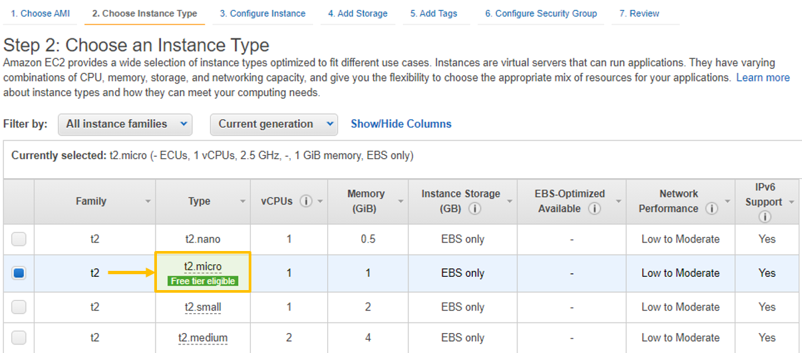
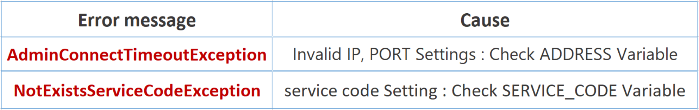

# Introducing ARCUS Single Cache (Dev.) on AWS Marketplace and How to Use It

</img>

`ARCUS Single Cache(Dev.)` is configured as an AMI(Amazon Machine Image) to provide an easy and fast experience of ARCUS on AWS Marketplace.
`ARCUS Single Cache(Dev.)` uses AMI configuration to support one-click deployment to ease the use of ARCUS Cache. You can check the `ARCUS Single Cache (Dev.)`
on AWS Marketplace from here ([URL](https://aws.amazon.com/marketplace/pp/prodview-rbrii3scbuoge?qid=1620957097048&sr=0-1&ref_=srh_res_product_title)).

### What’s Amazon Machine Image?
An Amazon Machine Image or AMI is a packaged environment containing a software(OS, Application Server) configuration and other additional
applications required to set up an instance to deliver a service or a part of it.

Previously, to use the ARCUS Cache, first you needed to clone it from its Github repository ([URL](https://github.com/naver/arcus)) and go through various build/setup processes. 
This method can be a little bit difficult for first-time users. `ARCUS Single Cache (Dev.)` solves this difficulty, and it’s much easier and faster to 
experience ARCUS Cache. In this article, I’ll introduce you to `ARCUS Single Cache(Dev.)` and how to use it.

## ARCUS Single Cache (Dev.)

`ARCUS Single Cache(Dev.)` has been implemented as a light version of the ARCUS Cache Cluster to experience the basic features. 
As the name suggests, `ARCUS Single Cache(Dev.)` supports a single cache owing to consist of only one node, thus being limited to only some of the features of ARCUS.

### Configuration Details

Besides the clustering feature, `ARCUS Single Cache(Dev.)` limits available memory and connection resources while providing most of the basic main features 
for a single cache. Configuration details of `ARCUS Single Cache(Dev.)` are as follows:

- Memory size: 250MB
- Connection size: 1024

### Provided Features

`ARCUS Single Cache(Dev.)` supports simple **key-value** data type and a **collection** (List, Set, Map, B+Tree) data structure that stores 
and views multiple values in a structured form in a single key. It also provides a prefix feature to form a group and manage keys. The details are as follows.

### Cache Item

In addition to simple **key-value**, `ARCUS Single Cache(Dev.)` provides various item types in a **collection data structure**.

- **Key-Value**: a simple key-value item that stores a single value.

### Collection item

- **List item:** an item that has a double-linked list of data elements.
- **Set item:** an item that has an unordered set of unique data elements.
- **Map item:** an item that has an unordered set of `<field, data>` pairs.
- **B+tree item:** an item that has a data set sorted by a b+tree key.

B+tree supports efficiently *range* search in both backward and forward directions as well as *exact* search. Each element of b+tree has a unique key and a set of elements is sorted by these unique keys in its b+tree structure.

### Cache Key

Cache key identifies the data to be stored in the `ARCUS Single Cache(Dev.)`. It has a syntax of `<prefix>:<subkey>`.

- `Prefix` is a name preceding the cache key. You can group keys stored in a cache server to flush or view stat info in `prefix units`. 
  `prefix` can be omitted but it’s recommended to be used as much as possible. prefix can only consist of: Uppercase letters, numbers, (_)underbars,
  (-)hyphens, (+)plus, and (.)dots characters.

- `delimeter (:)` is a character used to separate prefix and subkey.

- `Subkey` is a _key_ commonly used in applications to distinguish cache items. subkey cannot contain spaces, and by default,
  it is recommended to use only alphanumeric characters.

So up to this point, I have given you general information about `ARCUS Single Cache(Dev.)` and from now on I will show you how to use it on AWS.

## Creating ARCUS Single Cache (Dev.)

Before creating `ARCUS Single Cache(Dev.)` first thing you need to do is create an AWS account. If you don’t have an account, please create an account before proceeding.
Now, login into **AWS Management Console([URL](https://aws.amazon.com/console/))** and let’s create an EC2 instance to experience ARCUS.

1. Click the **Services** tab on the upper left corner of Console.

</img>

2. Choose **EC2** under Compute Category.

</img>

3. Once you’re in the EC2 Dashboard, click the **Launch Instance**.

</img>

4. Now Step-1: Choose an Amazon Machine Image (AMI) page will appear. Choose the AWS Marketplace that you’ll see on the left side of the page.

</img>

5. Search for an arcus, Select the ARCUS Single Cache(Dev.) and continue.

</img>

6. Now, on `Step-2: Choose an Instance Type`, select the instance type of your choice, but I’ll go with the `t2.micro` instance, 
as it's the vendor’s recommendation, and also Micro instances are free for up to 750 hours a month.

</img>

7. Now that all settings are complete,` Step-7: Review` page will appear. If you scroll down the page, you can check the port settings (`SSH Connect(22)`,
 `ARCUS ZooKeeper (2181)`, and `ARCUS Memcached (11211)`.) to access ARCUS. In addition, all IPs `(0.0.0.0/0)` are opened/allowed by default.
 This may expose you to security issues, so we recommend checking your IP address and whitelisting it before you start.
 
8.  Finally, to launch your instance choose an existing or create a new ke**y-pair** and download your key-pair **(.pem)** file. 
Put the .pem file into the same directory where your EC2 instance will run, it is important for SSH access.

### Verify ARCUS

After connecting to the ARCUS Cache instance, via `telnet` we will check whether `arcus-memcached` is running and conduct a simple test.
Now please enter your EC2 instance’s public IP and port, as shown below.

```
$ telnet [IP address] 11211
```

Now that you’re connected to ARCUS, try a `stats` command as shown below. The result of this command will show you ARCUS cache statistics such as PID,
version info, memory usage, and computation performance.

```
$ stats
```

In addition, you can try some other commands([URL](https://www.jam2in.com/arcus-docs/#/arcus-server/ARCUS-Server-Ascii-Protocol/1.13/ch04-command-key-value)) on arcus-memcached.

## Using ARCUS Single Cache (Dev.) with ARCUS Java Client

In order to use `ARCUS Single Cache(Dev.)` with Java application, you need ARCUS Java Client. In the following sections, 
I will show you the required settings to use Java Client.

### Environment Settings

Once you have established the below-listed environment settings, please create a Java project to proceed.

- Apache Maven (higher than version 4)
- Java (higher than version 1.6)
- Eclipse / Intellij IDEA

### POM.XML Configuration

Once the project has been created, please update your POM file for installing dependencies as shown below.

```xml
<project xmlns="http://maven.apache.org/POM/4.0.0" xmlns:xsi="http://www.w3.org/2001/XMLSchema-instance"
xsi:schemaLocation="http://maven.apache.org/POM/4.0.0 http://maven.apache.org/xsd/maven-4.0.0.xsd">    
<modelVersion>4.0.0</modelVersion> 
 
  <groupId>com.navercorp.arcus</groupId>
  <artifactId>arcus-quick-start</artifactId>
  <version>1.0-SNAPSHOT</version>
  <packaging>jar</packaging>
  <properties>
    <project.build.sourceEncoding>UTF-8
    </project.build.sourceEncoding>
  </properties>
  <dependencies>
  <!-- ARCUS Java Client Dependency -->
    <dependency>
      <groupId>com.navercorp.arcus</groupId>
      <artifactId>arcus-java-client</artifactId>
      <version>1.13.0</version>
    </dependency>
    
 <!-- logging Dependency -->
    <dependency>
      <groupId>org.apache.logging.log4j</groupId>
      <artifactId>log4j-core</artifactId>
      <version>2.13.3</version>
      <optional>true</optional>
    </dependency>
    <dependency>
      <groupId>org.apache.logging.log4j</groupId>
      <artifactId>log4j-api</artifactId>
      <version>2.13.3</version>
      <optional>true</optional>
    </dependency>
    <dependency>
      <groupId>org.apache.logging.log4j</groupId>
      <artifactId>log4j-slf4j-impl</artifactId>
      <version>2.13.3</version>
       <exclusions>
        <exclusion>
          <groupId>org.slf4j</groupId>
          <artifactId>slf4j-api</artifactId>
        </exclusion>
       </exclusions>
       <optional>true</optional>
    </dependency>
    <dependency>
      <groupId>org.slf4j</groupId>
      <artifactId>slf4j-api</artifactId>
      <version>1.7.24</version>
    </dependency>
  </dependencies>
</project>
```

### Create HelloARCUS.java
Now let's create `HelloArcus.java` within the project. You can use the below code as it is, but make sure to enter your **EC2 instance’s public IP address** as the `ADDRESS` variable.

```java
import net.spy.memcached.ArcusClient;
import net.spy.memcached.ConnectionFactoryBuilder;import java.util.concurrent.Future;
import java.util.concurrent.TimeUnit;
//HelloArcus.java
public class HelloArcus {
  
//Enter your corresponding EC2 IP address into ADDRESS.
  private static final String ADDRESS = "YOUR INSTANCE IP:2181";  
//Default value for service code is `test`.
  private static final String SERVICE_CODE = "test";
public static void main(String[] args) throws InterruptedException 
{
  System.setProperty("net.spy.log.LoggerImpl",
  "net.spy.memcached.compat.log.SLF4JLogger");
    ArcusClient client =
      ArcusClient.createArcusClient(ADDRESS, SERVICE_CODE,
      new ConnectionFactoryBuilder());
//Enter key, expiredTime, value of your choice.
  client.set("test:hello", 30, "Hello Arcus!");
//Inquiry the saved value using key.
  Future<Object> future = client.asyncGet("test:hello");
  String hello = null;
    try {
      hello = (String) future.get(700, TimeUnit.MILLISECONDS);
    } catch (Exception e) {
      future.cancel(true);
      } 
    if(hello == null) {
      hello = "not ok!";
    }
    System.out.println(hello);
 }
}
```

### Create logging File
Next, we create a `log4j2.xml` file in the `src/main/resources/` directory for logging.

```xml
<?xml version="1.0" encoding="UTF-8"?>
<Configuration>
  <Appenders>
    <Console name="console" target="SYSTEM_OUT">
      <PatternLayout pattern="%d{yyyy-MM-dd HH:mm:ss} [%-5p](%-35c{1}:%-3L) %m%n" />
    </Console>
    </Appenders>
    <Loggers>
      <Root level="WARN">
        <AppenderRef ref="console" />
      </Root>
    </Loggers>
</Configuration>
```

### Run
Now that all setups are completed, return back to the `HelloArcus.java` file and run it. If all setups have been completed normally, you should get the following message:

```
Hello Arcus!
```

In case of the following error messages, please check your settings again.

</img>

Up to now, I have shown you how to simply store and lookup data in ARCUS using Java client. There are many more useful features to discover using ARCUS Java Client,
such as APIs that utilize collection data structure, asynchronous APIs, etc. that can be useful in the Application. Please refer to ARCUS Java Client documentation([URL](https://www.jam2in.com/arcus-docs/#/arcus-clients/java-client/1.13/03-key-value-API))
for more details.

## Conclusion

In summary, I have introduced and explained the basic usage of `ARCUS Single Cache(Dev.)`. `ARCUS Single Cache(Dev.)` was developed as a light version of the
ARCUS Cache Cluster to experience the basic features and to ease the use of ARCUS Cache. You can always access it for free up to 750 hours from AWS Marketplace using 
`EC2: t2.micro` instance. `ARCUS Single Cache(Dev.)` is good for small-scale projects to improve performance where caching is needed. In the future, we will provide new ARCUS products with enriching features as an AMI in AWS Marketplace.

- ARCUS Single Cache (service purpose)
- ARCUS Cache Cluster

▪☞ [AWS Marketplace: ARCUS Single Cache(Dev.)](https://aws.amazon.com/marketplace/pp/prodview-rbrii3scbuoge?qid=1620957097048&sr=0-1&ref_=srh_res_product_title)


