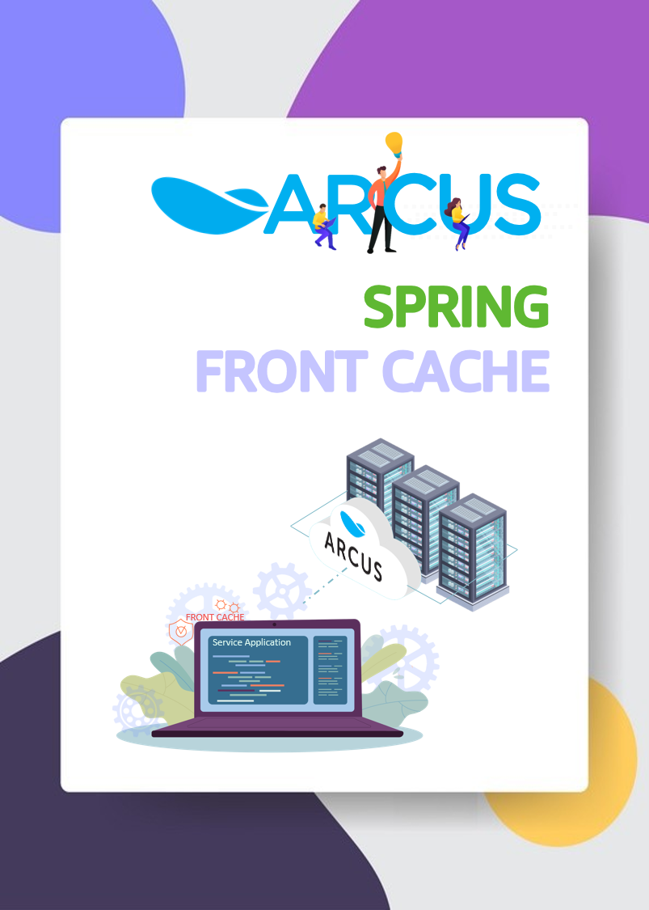
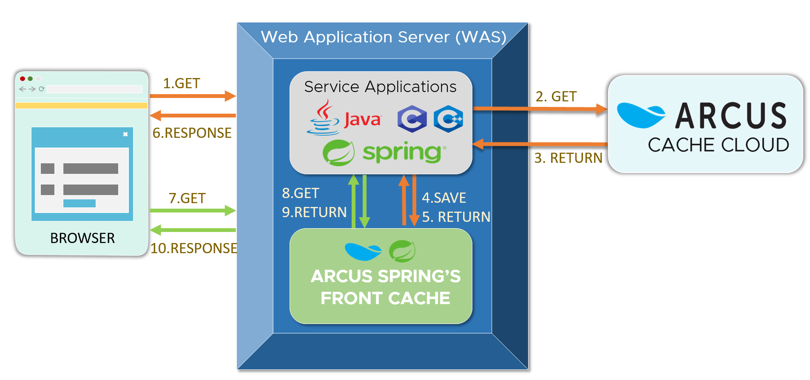

# Introducing Front Cache of ARCUS Spring

</img>

## Front Cache

Remote cache solutions that perform caching on separate servers such as ARCUS Cache have advantages in sharing data with each other that has been cached on multiple
applications. However, on the remote cache, data response time sensitively gets affected depending on the occurrence of a large amount of network traffic or 
lack of resources due to a large number of temporary requests on the software. These kinds of problems can be solved by scaling a cluster or upgrading the system’s 
specifications, but in that case, there is a burden of increasing operation costs. On the other hand, there is also a software-wise solution that is relatively less
expensive, and that is, caching data in the front of the remote cache using the local memory of the application. This method is called **Front Cache**, also known as local
caching because it is cached in local memory. Caching data to the local memory is much faster than caching it to the remote server over the network. One of the advantages
of Front Cache is its being not affected by network traffic, and let’s say if you are managing traffic load data, such as events, announcements, trend news then by 
applying Front Cache you can guarantee fast response time and high throughput for your application.

In order to be able to do that, we specifically implemented [Spring Cache](https://docs.spring.io/spring-framework/docs/4.1.x/spring-framework-reference/html/cache.html) of Spring Framework for ARCUS and added the interface of Front Cache to the latest 
version of the [ARCUS Spring](https://github.com/naver/arcus-spring)(1.13.3)’s library. In this article, I will introduce you to the Front Cache features of ARCUS Spring, its behaviors, usage method, and precautions to be aware of.

</img>

## How Front Cache works

The Front Cache provided by ARCUS Spring performs caching before the ARCUS. The organized behavioral structure based on the request types is as follows.

### Retrieval of Cache Data

1. First, in order to retrieve data, application calls `get` API of Spring Cache interface.
2. Check if the data exists in the Front Cache. If it is, then we return the requested data.
3. If data does not exist in the Front Cache, check if the data exists in the ARCUS Cache. If it is, we store the data in the Front Cache and then return the requested data.

### Store Cache Data
1. In order to save data, application calls `put` API of Spring Cache.
2. Then request storing data into ARCUS Cache.
3. (Option 1) Only when the data storing request to ARCUS is successfully completed, then store the data to the Front Cache.
4. (Option 2) Regardless of the result of data storing request to ARCUS, store the data to the Front Cache.

### Removal of Cache Data
1. In order to delete data, application calls `evict/clear` API of Spring Cache.
2. Then request data removal from ARCUS Cache.
3. (Option-1) Only when the data removal request from ARCUS is successfully completed, remove the data from the Front Cache.
4. (Option-2) Regardless of the data removal request from ARCUS, remove the data from the Front Cache.

In the cases of storing and removing data, Option 1 is set as default, but you can change it with [forceFrontCaching](https://github.com/naver/arcus-spring#configuration-1). 
If the ARCUS Cache is not available due to a network issue, Option 2 can still maintain the Front Cache function. If your data changes over time then Option 1,
if it isn’t then Option 2 is recommended.

## How to Use

[ArcusCache](https://github.com/naver/arcus-spring/blob/1.13.3/src/main/java/com/navercorp/arcus/spring/cache/ArcusCache.java) class is specifically 
implemented for ARCUS from Spring Cache interface and relies on the abstracted [interface](https://github.com/naver/arcus-spring/blob/1.13.3/src/main/java/com/navercorp/arcus/spring/cache/front/ArcusFrontCache.java) below for front caching. 
It provides flexibility and allows to implement the interface directly to use other remote or local caches as front caching for ARCUS as shown below.

```java
public interface ArcusFrontCache {

  Object get(String key);
  void set(String key, Object value, int expireTime);
  void delete(String key);
  void clear();
}
```

Although you don’t need to implement the interface by yourself, you can always use the [DefaultArcusFrontCache](https://github.com/naver/arcus-spring/blob/1.13.3/src/main/java/com/navercorp/arcus/spring/cache/front/DefaultArcusFrontCache.java) class built into ARCUS Spring.
This class caches the data into the application’s local memory and uses the [EhCache](https://www.ehcache.org/) library internally. Now we will try to apply this class to Spring-based
applications to perform Front Caching before ARCUS Cache.

First, we create the `DefaultArcusFrontCache` class then set the dependencies on the ArcusCache class. For the purpose of the testing, we will set TTL(TimeToLive) of the 
**Front Cache** to 10 seconds, 20 seconds shorter than the ARCUS cache.

```java
public class ArcusCacheConfiguration {

  @Bean
  public ArcusCache testCache() {
      ArcusCache arcusCache = new ArcusCache();
      arcusCache.setName("test");
      arcusCache.setServiceId("TEST-");
      arcusCache.setPrefix("TEST");
      arcusCache.setTimeoutMilliSeconds(800);
      arcusCache.setArcusClient(arcusClient());
      // Setting TTL of ARCUS Cache item
      arcusCache.setExpireSeconds(30);      
      // Setting Front Cache Instance
      arcusCache.setArcusFrontCache(testArcusFrontCache());
      // Setting TTL of Front Cache item
      arcusCache.setFrontExpireSeconds(10);
     // Even if Store/Removal requests of ARCUS fail 
     // Set to perform Store/Removal requests of Front Cache
      arcusCache.setForceFrontCaching(true);
      return arcusCache;
  }

  @Bean
  public ArcusFrontCache testArcusFrontCache() {
    return new DefaultArcusFrontCache(
      // Cache name, for each instance names must be unique
      "test", /* name */
      
      // Maximum number of cache items to be stored
      // If max is exceeded, existing item will be removed by LRU
      10000, /* maxEntries */
      // when retrieving item instance from the Front Cache
      // Setting for retrieve the reference of item or copy of it
      // Retrieves the item's reference when set to false
      false, /* copyOnRead */
      // when storing item instance into the Front Cache
      // Setting for storing the reference of item or copy of it
      // Stores the item's reference when set to false
      false /* copyOnWrite */
    );
  }

  @Bean
  public ArcusClientPool arcusClient() {
    ArcusClientFactoryBean arcusClientFactoryBean = new ArcusClientFactoryBean();
    arcusClientFactoryBean.setUrl("1.2.3.4:1234");
    arcusClientFactoryBean.setServiceCode("test");
    arcusClientFactoryBean.setPoolSize(8);
    return arcusClientFactoryBean.getObject();
  }
}
```

Add the `ArcusCache` instance that you just created to the cache list of `CacheManager`.

```java
@EnableCaching
@Configuration
public class CacheConfiguration implements CachingConfigurer {

  @Autowired
  private ArcusCache testCache;

  @Bean
  @Override
  public CacheManager cacheManager() {
    SimpleCacheManager arcusCacheManager =
        new SimpleCacheManager();
    arcusCacheManager.setCaches(
      List.of(testCache)
    );
    return arcusCacheManager;
  }

  @Override
  public KeyGenerator keyGenerator() {
    return new StringKeyGenerator();
  }

  @Override
  public CacheResolver cacheResolver() {
    return null;
  }

  @Override
  public CacheErrorHandler errorHandler() {
    return null;
  }
}
```

We have now completed the Front Cache configuration. Now let's apply [@Cacheable](https://docs.spring.io/spring-framework/docs/current/javadoc-api/org/springframework/cache/annotation/Cacheable.html) Annotation to the service that you want to apply cache
and then check if Front Cache has been applied correctly.

```java
@Service
public class ProductService {

  @Autowired
  private ProductRepository productRepository;

  @Cacheable(value = "test", key="#product.id")
  public Product get(Product product) {
    return productRepository.select(productDto.getId());
  }
}
```

Every time when you send the request to the service that you have added caching feature, log below from the `ArcusCache` class will be printed.
- (1) Initially there is no data in ARCUS Cache and Front Cache, therefore the first thing to do is to store data in both.
- (2) Retrieve and return the data from Front Cache. Since we have set TTL of Front Cache for 10 seconds, ARCUS Cache will not look for it until data is expired in the Front Cache.
- (3) When the data stored in Front Cache is expired after 10 seconds, lookup for data from Front Cache will be failed, thus the data will be retrieved from ARCUS Cache, and stored in the Front Cache.
- (4) Same procedure in step (2) will be performed.

```
DEBUG 21-07-16 17:42:05 [ArcusCache:448] - getting value by key: TEST-PRODUCT:1266
DEBUG 21-07-16 17:42:05 [ArcusCache:480] - trying to put key: TEST-PRODUCT:1266, value: com.jam2in.arcus.Product ... (1) Stores in ARCUS, Front Cache
DEBUG 21-07-16 17:42:07 [ArcusCache:448] - getting value by key: TEST-PRODUCT:1266 
DEBUG 21-07-16 17:42:07 [ArcusCache:454] - front cache hit for TEST-PRODUCT:1266 ... (2) Returns retrieved data from Front Cache
DEBUG 21-07-16 17:42:10 [ArcusCache:448] - getting value by key: TEST-PRODUCT:1266
DEBUG 21-07-16 17:42:10 [ArcusCache:454] - front cache hit for TEST-PRODUCT:1266 ... (2)
DEBUG 21-07-16 17:42:15 [ArcusCache:448] - getting value by key: TEST-PRODUCT:1266
DEBUG 21-07-16 17:42:15 [ArcusCache:454] - front cache hit for TEST-PRODUCT:1266 ... (2)
DEBUG 21-07-16 17:42:16 [ArcusCache:448] - getting value by key: TEST-PRODUCT:1266
DEBUG 21-07-16 17:42:16 [ArcusCache:470] - arcus cache hit for TEST-PRODUCT:1266 ... (3) Returns retrieved data from ARCUS Cache since TTL of Front Cache is expired
DEBUG 21-07-16 17:42:17 [ArcusCache:448] - getting value by key: TEST-PRODUCT:1266
DEBUG 21-07-16 17:42:17 [ArcusCache:454] - front cache hit for TEST-PRODUCT:1266 ... (4) Return retrieved data from Front Cache
DEBUG 21-07-16 17:42:18 [ArcusCache:448] - getting value by key: TEST-PRODUCT:1266
DEBUG 21-07-16 17:42:18 [ArcusCache:454] - front cache hit for TEST-PRODUCT:1266 ... (4)
```

The above example shows how a single Front Cache is created. But you can always configure **N** Front Caches instead of a single one.
For example, if you want to use a unique front cache for each service, you can set it up as follows.

```java
@Bean
public ArcusCache productCache() {
    ArcusCache arcusCache = new ArcusCache();
    arcusCache.setName("product");
    ... (omitted) ...
    arcusCache.setArcusFrontCache(productFrontCache()); 
    // Using Product Front Cache
    return arcusCache;
}

@Bean
public ArcusFrontCache productFrontCache() {
  // Create a product Front Cache
  return new DefaultArcusFrontCache(
   "productFront", 20000, false, false);
}

@Bean
public ArcusCache eventCache() {
    ArcusCache arcusCache = new ArcusCache();
    arcusCache.setName("event");
    arcusCache.setPrefix("EVENT");
    ... (omitted) ...
    arcusCache.setArcusFrontCache(eventFrontCache());
    // Using Event Front Cache
    return arcusCache;
}

@Bean
public ArcusFrontCache eventFrontCache() {
  // Create an Event Front Cache
  return new DefaultArcusFrontCache(
  "eventFront", 10000, false, false);
}
```

Please note that Front Cache instances created in the above example do not share data between themselves due to each instance has a different hash table.
But if you want to share data of multiple ARCUS Cache instances with Front Cache, then you can create one Front Cache instance as shown below, and assign
it to multiple ARCUS Cache instances.

```java
@Bean
public ArcusCache productCache() {
    ArcusCache arcusCache = new ArcusCache();
    arcusCache.setName("product");
    ... (omitted) ...
    // Using share Front Cache    
    arcusCache.setArcusFrontCache(sharedFrontCache()); 
    return arcusCache;
}

@Bean
public ArcusCache eventCache() {
    ArcusCache arcusCache = new ArcusCache();
    arcusCache.setName("event");
    arcusCache.setPrefix("EVENT");
    ... (omitted) ...
    // Using share Front Cache     
    arcusCache.setArcusFrontCache(sharedFrontCache()); 
    return arcusCache;
}

@Bean
  // Using share Front Cache
  public ArcusFrontCache sharedFrontCache() { 
  return new DefaultArcusFrontCache("shared", 50000, false, false);
}
```

## Warnings

The performance of Front Cache which is stored in the local memory of the application is much faster than a remote cache but it isn’t available 
in all types of cases. Please take a look at the following issues when using the Front Cache.

### High Memory Usage

Front Cache stores the same data in the memory of all applications, therefore it has the disadvantages of requiring a lot of memory space.
Depending on the number of expired and no longer referred cache data, it will cause frequent use of the Garbage Collection of JVM and result in low
application performance. Therefore, considering memory usage of the application the maximum size and amount of the data that can be stored in the Front Cache must be estimated.
If you are using the `DefaultArcusFrontCache` class of ARCUS Spring, you can set the maximum number of data that can be stored with the `maxEntries` property.

### Data Mismatch
Generally, data mismatch occurs between applications due to the multiple applications are unable to share cache data. For example, if you perform a data change request
to a particular application, other applications’ Front Cache does not reflect the changed data. Because of this, there is a problem with inconsistent data
response for a request in a multi-server environment. We can resolve the data mismatch problem in the following manners:

- We set short TTL for Front Cache. Even in the case of hot data that gets a lot of requests, with a short expiration time, it will still show high performance.
- We set the **Sticky Session** on the load balancer at the front of the application and depending on the session we convey the request to the server that first processed it.
- We only front cache small changes of data.

### Dual Caching (in case of ARCUS Java Client Usage)

[Java Client of ARCUS](https://github.com/naver/arcus-java-client/blob/master/docs/02-arcus-java-client.md#transparent-front-cache-%EC%82%AC%EC%9A%A9) also has an internal [Front Cache feature](https://github.com/naver/arcus-java-client/blob/master/docs/02-arcus-java-client.md#transparent-front-cache-%EC%82%AC%EC%9A%A9). However, there are some limitations such as TTL, the maximum number of data,
and other properties of a Front Cache that must be shared for every cache target. If this limitation doesn’t concern you much, then using only 
ARCUS Java Client’s Front Cache would be enough. But if you want to use the Front Cache of ARCUS Spring with different properties per cache target 
then to prevent dual caching you have to disable ARCUS Java Client’s Front Cache function (it’s **disabled by default**). 
But if you are switching from ARCUS Java Client’s Front Cache to ARCUS Spring’s Front Cache then you need to directly disable the front cache function of 
ARCUS Java Client as shown below.

```
ConnectionFactoryBuilder factory = new ConnectionFactoryBuilder();
// Set to 0 to disable the Front Cache. Default value is 0.
factory.setMaxFrontCacheElements(0); 
ArcusClient client = new ArcusClient(SERVICE_CODE, factory);
```

## Conclusion

In summary, I have introduced and explained the Front Cache’s features provided by ARCUS Spring. If you are aware of the warnings for the usage of front
cache and apply safety measures, then you can experience improvement in the performance of request processing for more applications, 
rather than using ARCUS Cache alone. However, there are limitations for front cache to be applied. 
In order to be able to apply front cache to the more cache targeted areas **synchronization feature** must be included to eliminate inconsistencies in data between 
other front caches of multiple applications, as well as in ARCUS Cache.

ARCUS Spring project has been improving steadily, and we will keep you informed on further enhancements and additions to the front cache in our next articles.

