# Sustainable Caching Method in ARCUS and How To Apply It

In large-scale applications for general users, when retrieving data (especially hot data), a high volume of requests towards the DB will result in a high load. 
Therefore a general method to reduce the load on the DB side and to provide a fast response is storing the frequently retrieved data in the distributed cache of an application.

When it comes to applying cache to the application, `Demand-fill` caching pattern is the most commonly used method. When an application requests data,
first it will be checked in the cache-store, if data exists in the cache, retrieve data from the cache, otherwise, data will be retrieved from the database, 
stored into the cache, and after that, it will be returned. Hence a fast response can only be provided if data exists in the cache. Please check the
[ARCUS Common Cache Module Use with Basic Pattern Caching in Java Environment](https://github.com/jam2in/arcus-works/blob/master/techblog/202011_arcus_common_module_en.md)
for more details on the `demand-fill` method.

However, the problem with this method is that when data in the database has been modified, this update won’t be reflected on the data in the cache. Therefore to reduce the data mismatch between DB and cache, Expire Time or Time-To-Live(TTL) is set. Because of this characteristic following issues may occur.

1. The difference in response latency to the request, in the cases of caching and expired caching.
2. DB load with a high volume of requests, right after the cache data expire until the data is cached again.

These are the problems that occur when the cached data has expired and all requests go to the database, especially the second issue is referred to as cache stampede.

## Cache Stampede

</img>

A stampede is a situation in which a group of large animals suddenly start running in the same direction in a sudden panicked rush. 
The same name and concept apply to a cache stampede problem when a popular cache item expires and is led by multiple requests for the item seeing a cache miss,
re-requesting the same item from the database which causes high load and high response latency both at the same time. This can cause the following problems.

- Delay of application response time
- Duplicated writes: when retrieving the expired cache item from DB and caching the same data again and again

## Cache Stampede Mitigation

Multiple approaches have been proposed to mitigate the cache stampede problem, one of the well-known approaches is
[“Optimal Probabilistic Cache Stampede Prevention”](https://cseweb.ucsd.edu//~avattani/papers/cache_stampede.pdf) which has been published at the 
International Conference on Very Large Data Bases(VLDB). Here are some of the introduced/proposed methods from that paper.

- **External re-computation**
    - Periodically regenerates cache items in the background process to prevent cache misses.
    - Cons.: burden of maintenance and periodically regenerated item list (key list) is required

- **Locking**
    - Upon a cache miss, grant a lock to the first request to prevent duplicated DB retrievals and renew a cache.
    - Cons.: only duplicated retrievals and duplicated write issues caused by cache miss can be solved this way, but other response latency issues continue when the cache expires.

- **Probabilistic Early Expiration (PER)**
    - Renew the cache with the calculated probability before the cache data expires using a stochastic algorithm.

Among the aforementioned methods, the main approach presented in detail in the paper is PER. To simply describe PER, it would be easy to explain it with the following images.

- State of Basic Caching

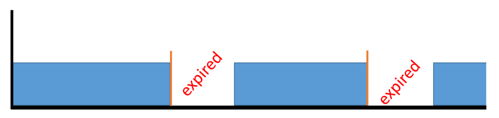</img>

The blue section is where the caching is applied, and the white part is where the cache got expired. Since a cache miss occurs only in the white part, it becomes a section where a lot of retrieval requests burden the database.

- State of Caching with PER

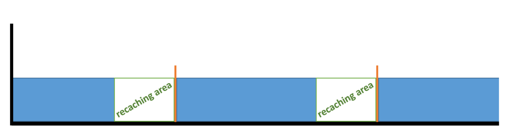</img>

This is a state in which caching is maintained without expiration by reaching before the cache item expires.
Compare to the above-mentioned basic caching the recaching occurs before expiration time thus preventing cache item expiration.

Every time when a thread that processes a request retrieves the cache data, PER algorithm performs recaching with the random probability 
compared to the remaining expiration time, and as the expiration time is approaching closer, the probability of recaching also increases. 
More about the probabilistic algorithm will be discussed later.

Now, let’s find out through a simple test how the algorithm actually works.

## Cache Stampede Mitigation: Test

Let's compare the performance outcomes of a cache expiration time for both basic caching and caching with PER by establishing the following test environments.

- **Test Conditions**

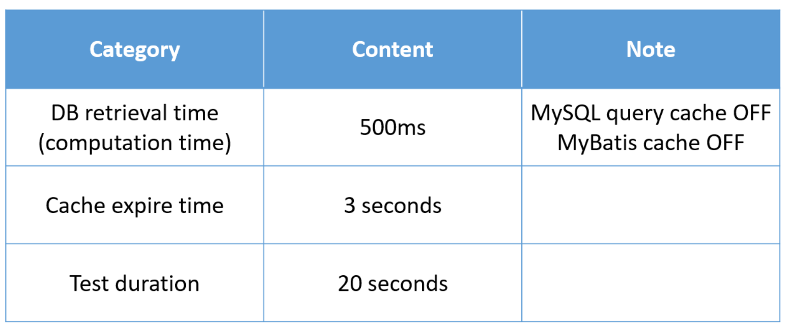</img>

- **Jmeter Settings**

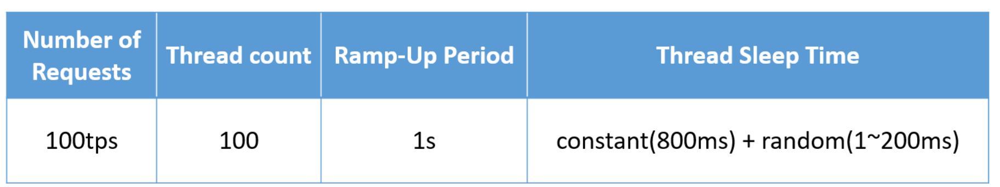</img>

- **Measurement Factors**
    - number of times cache miss occurred
    - response latency due to cache stampede
    - number of duplicated writes due to cache stampede

The results of the test of basic caching that doesn’t have any applied solution and caching with PER solution are as follows.

- **Caching** (cache miss: 4-times, response latency: 500ms, duplicated writes: 242-times)

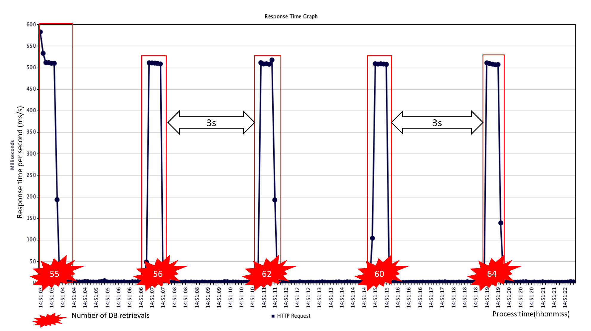</img>

- **PER** (cache miss: 0-times, response latency: 100~200ms, duplicated writes: 43-times)

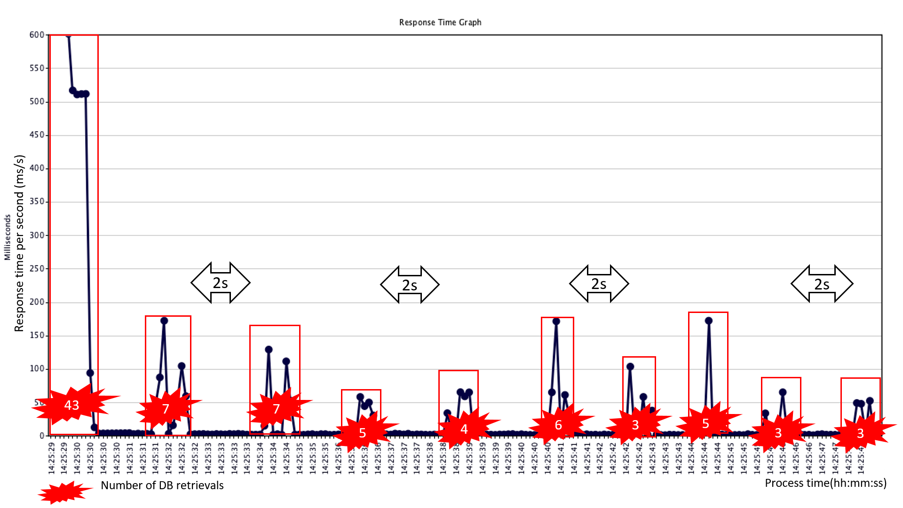</img>

Looking at the results, in the basic caching cache miss occurred due to the expiration, following many requests run to DB at the same time, 
thus resulting in cache stampede. Therefore there was a delay with responses at the DB side. Furthermore, due to the cache miss, 
all requests made for the cache item caused duplicated DB retrievals and cache writings.

On the other side, because PER algorithm is applied, recaching has been performed in advance and there was no cache miss in all parts that were scheduled to expire.
Only recaching performers sent requests to DB and the response time and the number of duplicated writes were significantly reduced. 
Consequently, this confirms that PER is effective in preventing cache stampedes.

## Practical Application Environment Test

In practical real applications, most DB retrieval times take from several to tens of milliseconds(ms). 
In this test, we have set the expiration time of cache items from dozens of seconds ~ to several minutes. 
Now let’s test how does PER actually works in real-world applications.

- **Test Conditions**

</img>

- **Jmeter Settings**

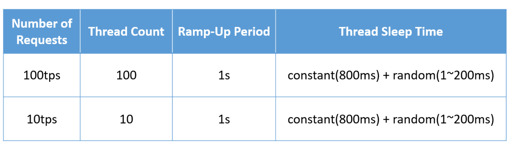</img>

- **Measurement Factors**
    - number of times cache miss occurred
    - response latency due to cache stampede
    - number of duplicated writes due to cache stampede

The results of the test, composed for practical applications are as follows.

- **100tps** (cache miss: 5-times, response latency: 0~100ms, duplicated writes: 95-times)

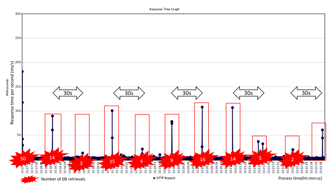</img>

- **10tps** (cache miss: 10-times, response latency: 100ms, duplicated writes: 20-times)

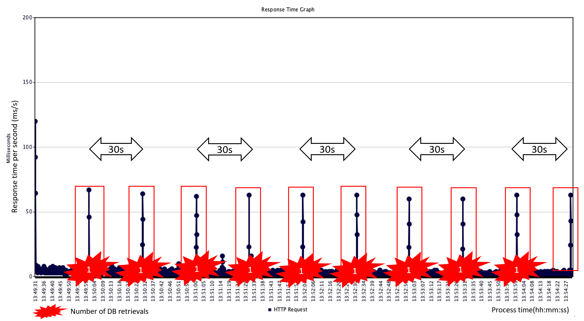</img>

Obviously, when testing on the actual application environment, the results differ from the initial one.

Compared to the initial test, unlike before in 100tps where only DB retrieval time has changed, some of them are recached, some had cache misses, 
and even resulting in cache stampede(response latency and duplicate DB retrievals and cache write) repeatedly. 
And in the 10tps there was no recaching in all expiration periods, causing a cache miss. Now the question is why did we get different results?

## Problems in Practical Application Environment Test

1. **ARCUS Cache measures expiration time in seconds and does not expire precisely at the actual time.**
    - A restriction on the application of the PER algorithm, which determines whether to recache in actual **ms units**.

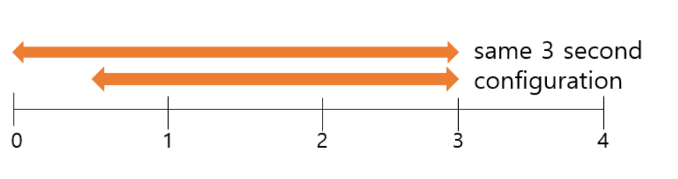</img>

In ARCUS, system calculations for item expiration are performed in seconds. I will use the above image to elaborate on my explanations. 
If the expiration time of different cache items is set to 3 seconds at different points between 0 and 1 second, then actual expiration will be performed simultaneously. 
For example, as shown in the picture, if you set expire time to 3 seconds at the point of 0th second, then it will expire at 3rd seconds, 
if you set expire time to 3 seconds at the point of 0.5th seconds, then it will also expire at 3rd seconds, not 3.5th seconds. 
The reason is the cache item expires with the ARCUS’s internal timer that works in seconds.

Even if the application measures the expiration time in detail with ms unit, because ARCUS processes expiration time in seconds, 
between application and ARCUS there is a gap of milliseconds, which affects the gap when determining whether or not to recache the item. 
Now that difference has been clarified, we can say that the reason why the repetitive cache misses occurred in the above test of 100tps is due to this problem.

2. **Requests with low tps have a low re-caching probability.**

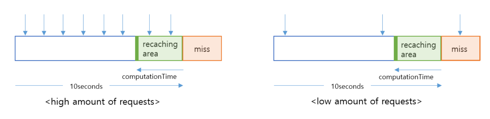</img>

Cache data with about 100 requests per second in practical applications corresponds to hot data. 
However, most of the data cached in the application will not/cannot be the hot data. 
If it’s a rare request several times per second or less, as shown on the right image above, there was no request for determining whether or not to recache, 
thus resulting in cache miss without recaching. The results can be checked in the graph of 10tps of the above test.

3. **Shorter the DB retrieval time(computation time), the smaller the recaching determination interval, the lower the recaching probability**.

Therefore, a clear understanding of the algorithm that determines to recache in PER is required. I will elaborate my explanation with the below-shown image.

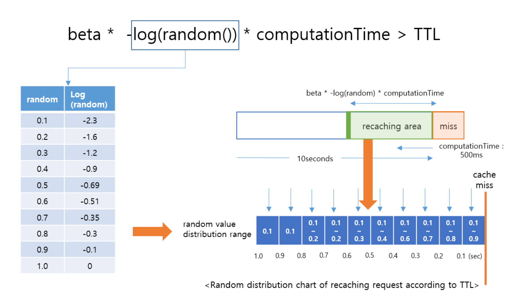</img>

First of all, the algorithm that determines recaching is the same as the above equation. 
Actual DB retrieval time(computation time) is multiplied by a probabilistic random value(**-log(random()**) and determines whether to recache or not, 
in comparison to the remaining expiration time(TTL).

For example, in the case of DB retrieval time of 500 ms, the probability of recaching is 10% when 1.0 ~ 0.9 seconds are left to the expiration time. 
As shown in the graph above, when the random value is 0.1, `500ms * 2.3(-log(0.1)) = 1150ms` is calculated, and since it is larger than the actual TTL (900 ~1000 ms),
it will be recached. Using the rest of the remaining random values(table 0.2 ~ 0.9) since the calculation result is smaller than the remaining expiration time, 
it won’t be recached. In the blue array(right) you can see the distribution range of random values that enable recaching at each time 
and check the recaching probability accordingly.

In practical real applications, since most DB retrieval times take from several to tens of milliseconds, if the corresponding equation is applied, 
the recaching determination interval is significantly reduced, thus it is less likely to recache even if there are many received requests. 
Of course, using a constant called `beta` it is possible to increase the range, however, it is very inconvenient for a user to apply constants differently 
considering the DB retrieval time for each API to which the algorithm is applied.

## Summary of Results and Requirements

Now that we have understood the concept, let's define the constraints for PER algorithm in order to apply it in a real working environment.

- Cache expiration at the exact time.
- High tps requests (at minimum higher than 50tps).
- Longer the DB retrieval time, the more effective it is.

Due to the above constraints, there are many problems when it comes to applying PER to ARCUS Common Module that actually operates in the real-world application environment.
Therefore, it is necessary to define the requirements of JaM2in to apply to the ARCUS Common Module and attain a suitable algorithm.

- Recaching is possible even if there is a cache expiration error.
- Recaching is possible even at the low tps.
- Recaching is possible even for cache data with a short DB retrieval time (recache regardless of DB retrieval time)
- Fast response speed within several to tens of milliseconds in all sections, DB retrieval and write requests without duplication.
    - After determining recaching on the request thread, it requests recache on the background thread.
    - In the case of PER, recaching is requested when the remaining expiration time is very short. Hence, if it is processed in the background thread, recaching may not be completed before expiration.

Through these requirements, from the perspective of implementation, we designed and applied the new algorithm that can prevent cache stampede.

## Sustainable Caching

Sustainable recaching(SUS) is a method designed by applying the PER algorithm. This method uses 10% of the cache expiration time as computation 
time instead of the actual DB retrieval time. Hence, the determination interval of recaching gets longer and allows recaching to take place even at low requests.

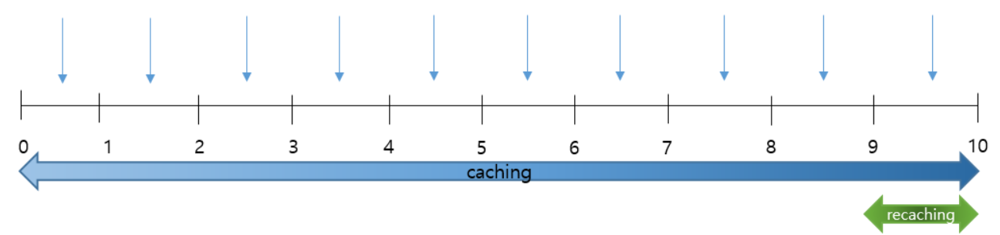</img>

Instead of simply expanding the range using a constant(beta), it uses 1/10 of the expiration time by specifying it as the DB retrieval time(computation time). 
Therefore, this is the form of using cached items as much as 90% of their expiration time when their TTL remains 10% and performing recaching through
a calculated probability based on that remaining 10%.

For example, if the expiration setting time is more than 10 seconds, the minimum time corresponding to 1/10 is 1 second, and since the recaching takes place within the range,
recaching will be done even if a request is received with a small request amount corresponding to 1tps.

In addition, in order to reduce response delays, we did not directly perform caching logic when requesting recache, but rather asked to perform recaching operations
in the background thread with sufficient time, and added redundant retrieval and write prevention.

A short summary of the types and properties of recaching is as follows.

- **PER**
    - Prevents cache misses before the cache expires by recaching.
    - Uses DB retrieval time (computation time) for recaching.
    - Recaching proceeds immediately from the request processing thread as it approaches the expiration time.

- **SUS**
    - PER and reaching determination algorithm logic are the same.
    - Recache using the expire time ratio when DB retrieval time (computation time) is less than 10% of expiration time.
    - Recaching proceeds in the background thread to prevent duplicated DB retrievals and cache writes.

- **Properties**

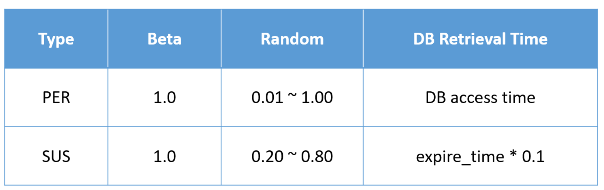</img>

The comparison of the corresponding algorithms through the example is as follows (DB retrieval time: 100ms, expire time: 30s)

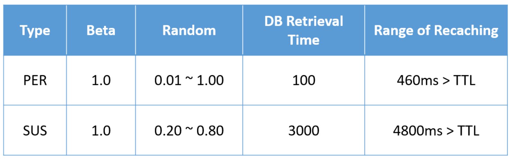</img>

Recaching range of the example is shown in the graph as follows.

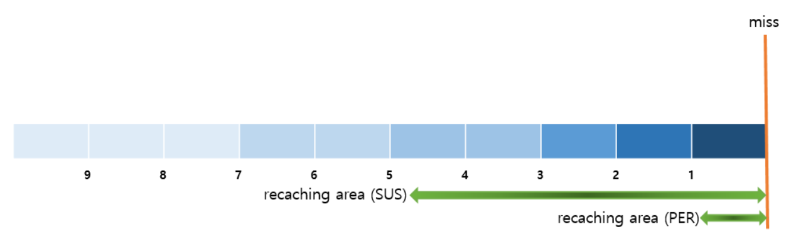</img>

## SUS Algorithm in Application Environment: Test

In order to compare SUS algorithm performance, the test was conducted under the same environment and conditions as PER.

- **100tps** (cache miss: 0-times, response latency: NONE, duplicated writes: 1-times)

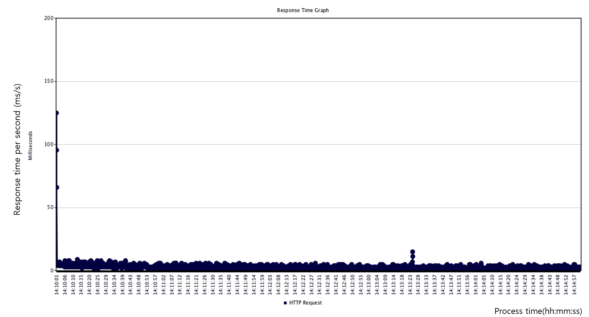</img>

- **10tps** (cache miss: 0-times, response latency: NONE, duplicated writes: 1-times)

</img>

As it is clear from the graph, even when the algorithm is applied according to the actual requirements, it has a great effect on the results.

Since cached data is constantly retrieved without delay in response, it can have a similar response effect to receiving a response by caching the items as a sticky item. 
In addition, when recache is requested, by preventing duplicated retrievals and writings, we were able to reduce the load of DB as well.

## Conclusion

In conclusion, we have checked the possible problems that may arise from the expiration time setting of the cache item. 
Among them, I have introduced you to the problem called a **cache stampede** that occurs when a lot of requests are received at the same time and how to solve it. 
We have implemented tests in order to apply to applications and designed a sustainable caching method that is applicable to ARCUS Common Module. 
SUS algorithm can give a fast response to the users not only for a large but also for a small number of requests regardless of the DB’s retrieval time. 
The future plan is to further enhance the SUS algorithm, with the additional features listed below.

- Simultaneous request test by applying it to multiple APIs.
- In order to perform reaching in the background, derivate the number of **threads** that are required, and the right size of the **queue** according to the number of application requests.
- Comparison and quantification of the difference in performance(WAS throughput, DB load level) from the previous one when the Sustainable caching method was introduced.

Improvement of the algorithm is also needed.

- When the expiration time is less than 1 second (in case of 1 second, DB retrieval time is set to 100ms), improve the algorithm that becomes the same as PER.

As we have already mentioned Sustainable caching is an algorithm that reflects the requirements to solve the cache stampede problem, 
and there is still some room for improvements to be made. In the future, even after SUS is applied to the application, 
through many tests we will improve and modify the algorithm. Stay with us for more updates.

### Reference:
**▪☞** [Optimal Probabilistic Cache Stampede Prevention](https://cseweb.ucsd.edu//~avattani/papers/cache_stampede.pdf)

