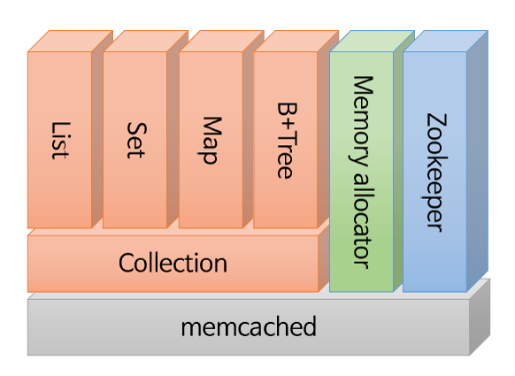
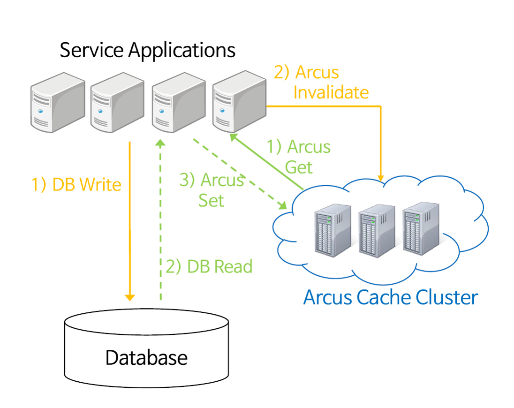
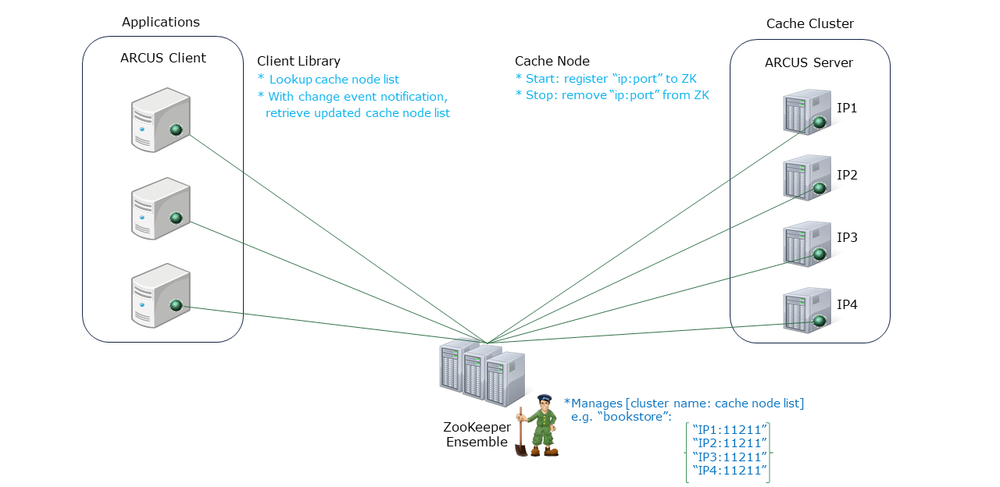
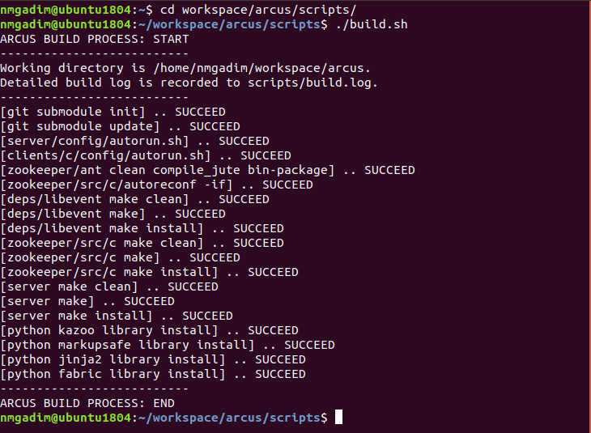
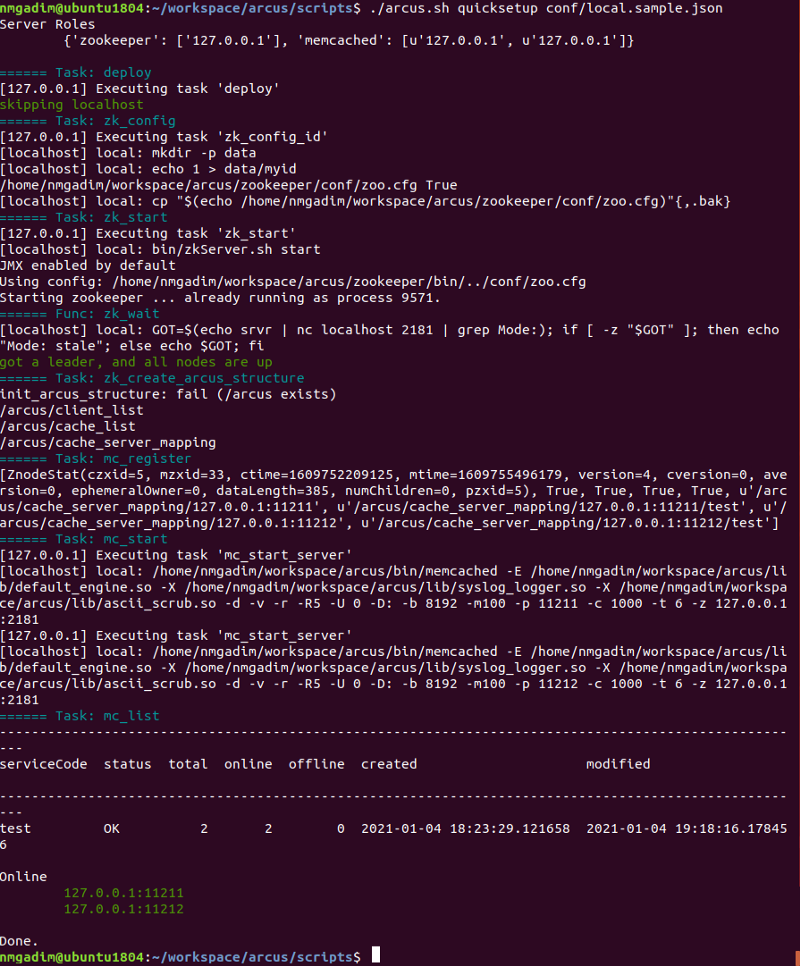
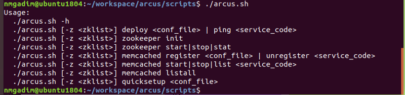
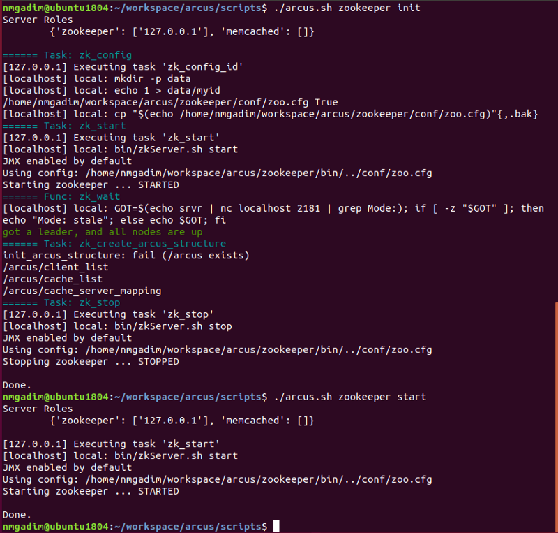
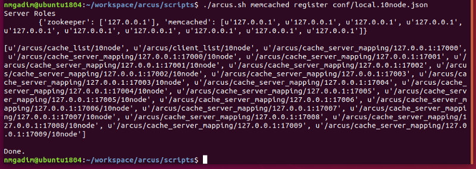
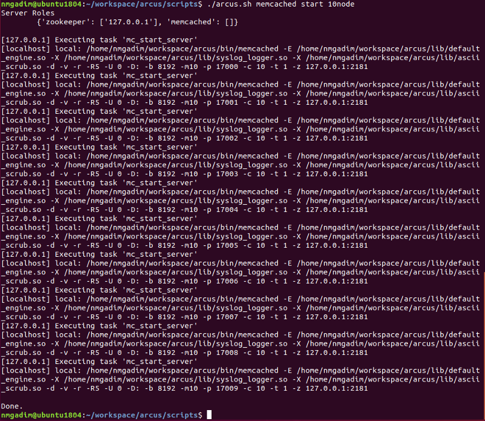
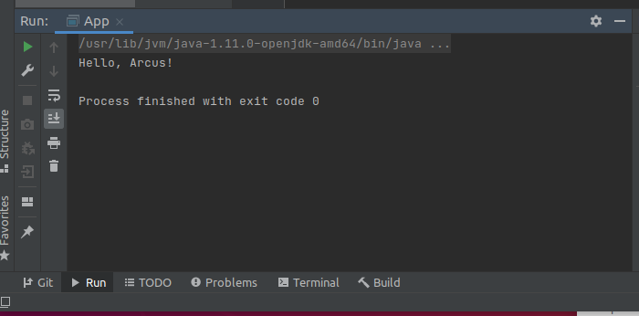

# A Brief Introduction into ARCUS Cache Cluster: Installation, Basic Usage, Hello World!

</img>

[ARCUS](https://github.com/naver/arcus) is an in-memory, [memcached-based](http://www.memecached.org), open-source, NoSQL datastore. Written in C and launched in 2014,
its high performance makes it a favorite as a fast data store - cache cluster. In this tutorial, I will introduce you to the ARCUS cache cluster, 
how to install and configure ARCUS on Ubuntu 18.04.

## Introduction  

</img>

ARCUS is a memory cache cluster that provides remote caching services. ARCUS provides a fast response to multiple applications while reducing the load to DB
by caching and servicing hot-spot data at the front of DB, which is typically back-end storage. In addition, you can quickly store and view complex computational
results or intermediate data from web processing, and share caching data among multiple processes. Besides a simple key-value data module with only one data in value,
ARCUS provides an expanded key-value data module with a collection (List, Set, Map, B+Tree) data structure that stores and views key-value data modules and multiple
values in a structured form. Arcus was implemented as an elastic cache cluster system where it uses [Zookeeper](http://zookeeper.apache.org) to add and remove 
nodes during operation.

## Collection Concept

</img>

- **Key-Value** - a structure that stores as a key-value pair.

- **List** - has a double linked list structure of Element. While maintaining head and tail element information, an element in a particular location can be 
accessed from head/tail to forward/backward direction. It is recommended to use the list as a queue concept because there is a performance issue when accessing 
an arbitrarily mid-positioned element from the large list of elements.

- **Set** - data structure is suitable for membership checking. An unordered set of unique value is internally used to store the hash table structure.
Similar to a typical tree structure, it has a hash table structure consisting of several depths, to dynamically resize the entire hash table proportionally
for the number of elements inside one set.

- **Map** - has an unordered set of <field, value>. It has a hash table structure to ensure the uniqueness of the field value and to accelerate the search 
for the corresponding element based on the field. To dynamically adjust the overall size of the hash table proportionally for the number of elements 
in a single map, the map's hash table structure consisting of multiple depths similar to a typical tree structure as well.

- **B+Tree** - conceptually it's similar to the sorted map based on the b+tree key. Each element has a unique key, which stores a set of elements 
sorted by its b+tree structure, and based on these unique keys it provides a range scan in backward/forward direction. It can also minimize memory use by using 
a b+tree structure that dynamically adjusts depth relative to the number of elements in the tree. In addition, b+tree's non-leaf node contains information 
on how many elements stored in the sub-tree on each sub-node. Position lookup and position-based element inquiry functions for a specific element also provided.

###  A Few Featured Concept
Here are some important features that ARCUS provides as a distributed key-value store structure to support reliable services.

- **Scalability** - Cache cluster can be scaled up or down through either caching target size, add/delete cache nodes depending on the number of requests for
caching data, or increase/decrease cache memory without disrupting the service during operation.
- **Availability** - Even if some cache nodes are down or there is a problem with network partition or with something else, the caching service will 
continue with the remaining cache nodes.
- **Fault-Tolerance** - If some cache nodes are down or not accessible, it will automatically find a failed cache node and remove the node from the 
cache cluster and update the cluster form with the remaining cache nodes.

An application program can use a Demand-fill caching pattern as shown below by adding the ARCUS cache cluster at the front of the DB.

</img>

- **Read** - at first lookup data from ARCUS cache with a `get` request, if the cache miss occurs, then lookup the data from DB and then cache the data into
ARCUS cache with a `set` request. Once the data is cached, the data can quickly be returned for the next read request.
- **Write** - Once the changed data written to DB, ARCUS cache invalidates the existing previous data with a delete request. After this, 
a read request for changed data will result in a cache miss, thus, data will be retrieved and cached from the DB to back in ARCUS for use.

### ARCUS Architecture

ARCUS manages multiple clusters (cluster name, cache node list, etc. information) of arcus-memcached node using Zookeeper. Each cluster is identified
with its unique **service code**. Think of the service code as the cluster's name. ARCUS clients get a real-time notification about the new cache node list 
when a cache node list is modified or changed.


</img>

A user can add/remove arcus-memcached nodes during operation. If there is a failed node, ARCUS can automatically detect and remove it.
The arcus-memcached node is identified by its name `(IP address:port number)`. ZooKeeper maintains a database of arcus-memcached node names, the service code 
that they belong to, and finally a list of alive nodes in each cluster.

## Establish a working environment

</img>

If you are not working on a Linux operating system, you can easily run Linux software in your current OS by setting up a  virtual machine with a free Linux distribution.
Virtual machines allow you to run any operating system on your desktop. You can install either [VirtualBox](http://virtualbox.org) or [VMware Workstation Player](https://www.vmware.com/products/workstation-player.html). Currently, 
ARCUS only supports 64-bit Linux. It has been tested on the following OS platforms:

- CentOS 6.x, 7.x - 64bit
- Ubuntu 12.04, 14.04, 16.04, 18.04 LTS - 64bit

In this article, I will use [Ubuntu 18.04.5](https://releases.ubuntu.com/18.04/) in VirtualBox. Download an ISO file for a Linux distribution and install Ubuntu inside the virtual machine like you 
would install it on a standard computer. 

ARCUS Configuration steps are as followed:

Step 1: Build - clone ARCUS from Github ARCUS repository, and build ARCUS
Step 2: Initialization - initialize Zookeeper ensemble and start Zookeeper process, then register cache cluster information into Zookeeper and start cache node.
Step3: Hello world - Using ARCUS Java Client say Hello Arcus to the World.

## ARCUS Setup on Ubuntu 18.04

Once you're installed Ubuntu, let's get started with the ARCUS setup. Before starting to keep our working space organized let's create a workspace 
directory and from now on, we will operate from this directory. Make sure you're running the following commands as a root or user with sudo privileges.

```
$ sudo apt update
# Make a directory
$ sudo mkdir ~/workspace
$ pushd ~/workspace
$ cd workspace
```

### Step 1: Install Dependencies and Build ARCUS

To quickly set up the ARCUS on Ubuntu, first, we have to install the required [dependencies](https://github.com/naver/arcus/blob/master/docs/howto-install-dependencies.md) -Apache  Maven, Java-OpenJDK, & Apache Ant. 
ARCUS supports Java version 1.8 or above.

```
# Install OpenJDK
$ sudo apt install default-jdk
...
$ javac -version
javac 11.0.9.1
$ java -version
openjdk version "11.0.9.1" 2020-11-04
OpenJDK Runtime Environment (build 11.0.9.1+1-Ubuntu-0ubuntu1.18.04)
OpenJDK 64-Bit Server VM (build 11.0.9.1+1-Ubuntu-0ubuntu1.18.04, mixed mode, sharing)
```

Once we are assured of JDK's successful installation we move on to the next dependencies. In the case of [Apache-Maven](https://maven.apache.org/download.cgi) and
[Apache-Ant](https://ant.apache.org/bindownload.cgi) check the latest version from the official website.

```
# (python >= 2.6)
$ sudo apt-get install build-essential autoconf automake libtool libcppunit-dev python-setuptools python-dev

# Install Apache Maven
$ wget https://downloads.apache.org/maven/maven-3/3.6.3/binaries/apache-maven-3.6.3-bin.tar.gz
$ sudo tar xf apache-maven-3.6.3-bin.tar.gz -C /etc

# Install Apache Ant
$ wget https://downloads.apache.org//ant/binaries/apache-ant-1.10.9-bin.tar.gz 
$ sudo tar -xf apache-ant-1.10.9-bin.tar.gz -C /usr/local

# Set the PATH inside the /.bashrc or /.bash_profile
$ vi ~/.bashrc 
export JAVA_HOME="/usr/lib/jvm/java-1.11.0-openjdk.x86_64"
export M2_HOME=/etc/apache-maven-3.6.3
export MAVEN_HOME=/etc/apache-maven-3.6.3
export PATH=${M2_HOME}/bin:${PATH}
export ANT_HOME=$HOME/usr/local
export PATH=$JAVA_HOME/bin:$ANT_HOME/bin:$PATH

$ source ~/.bashrc
$ popd
$ mvn -version
Apache Maven 3.6.3 (cecedd343002696d0abb50b32b541b8a6ba2883f)
Maven home: /etc/apache-maven-3.6.3
Java version: 11.0.9.1, vendor: Ubuntu, runtime: /usr/lib/jvm/java-11-openjdk-amd64
Default locale: en_US, platform encoding: UTF-8
OS name: "linux", version: "5.4.0-42-generic", arch: "amd64", family: "unix"

$ ant -version
Apache Ant(TM) version 1.10.9 compiled on September 27 2020
```

Now the all required environment dependencies have been successfully installed we can clone ARCUS from the [git repository](http://github.com/naver/arcus) and run 
a build shell script in arcus/script directory.

```
# Clone and Build ARCUS
$ git clone https://github.com/naver/arcus.git
$ cd workspace/arcus/scripts
$ ./build.sh
```

</img>

**NOTE:** if your build failed due to one of the following reasons, please refer to the given solutions below:

## A
A CPPUNIT library that comes within zookeeper configuration is an old version where ubuntu is no longer support it. Therefore, when you'll face 
`'AM_PATH_CPPUNIT' not found in library` error message all you have to do is make a little modification to the configuration file.

```
# Solution_1:
# in arcus/zookeeper/src/c/configure.ac file update the below code
$ vi configure.ac

# remove below displayed code block,
if test "$with_cppunit" = "no" ; then
   CPPUNIT_PATH="No_CPPUNIT"
   CPPUNIT_INCLUDE=
   CPPUNIT_LIBS=
else
   AM_PATH_CPPUNIT(1.10.2)
fi

# and instead add this code line

PKG_CHECK_MODULES([CPPUNIT], [cppunit],, [no_cppunit="yes"])

# save and close the file
```

If your ubuntu doesn't have a PKG-Config package installed, before going back to rebuild, make sure to install the pkg. A primary use of pkg-config is to provide 
the necessary details for compiling and linking a program to a library.

```
$ install apt install pkg-config
```

## B
Another error message you might face in Ubuntu is `'subdir-objects' is disabled` on `Makefile.am`.

```
# Solution_2
# in arcus/zookeeper/src/c/Makefie.am file add the below line
$ vi Makefile.ac

# add below code line
AUTOMAKE_OPTIONS = subdir-objects

# save and close the file
```

**NOTE:** for detailed information about the build process of [arcus-zookeeper](https://github.com/naver/arcus-zookeeper) and 
[arcus-memcached](https://github.com/naver/arcus-memcached), you can check GitHub repositories respectively.

### Step 2: Initialization - Create, start, stop ARCUS cache cluster

Once the build has been successfully completed, for the first time let's run the ARCUS using a quick setup.
```
# Setup a local cache cloud with conf file. (non-root user only)
$ ./arcus.sh quicksetup conf/local.sample.json

# Test
$ echo "stats" | nc localhost 11211 | grep version
STAT version 1.13.0
$ echo "stats" | nc localhost 11212 | grep version
STAT version 1.13.0
```

</img>

We used quick setup for running arcus by executing all required settings at once but you can also go through these steps executing them one by one, 
referring to the `./arcus.sh` help instructions by the given order.

</img>

But first, let's stop the arcus and re-run it again.

```
$ ./arcus.sh mecached stop test
$ ./arcus.sh memcached unregister test
$ ./arcus zookeeper stop
```

As I mentioned before zookeeper manages the cache node lists, cache names, and their service codes,
so the first thing we need to do is initiate and start a zookeeper.

```
$ ./arcus.sh zookeeper init
$ ./arcus.sh zookeeper start
```

</img>

Now that zookeeper is started we can register our arcus-memcached nodes and start them using their service code. The name of a service code is
provided inside the respective file.

```
$ ./arcus.sh memcached register conf/local.10node.json
```

</img>

```
$ ./arcus.sh memcached start 10node
```

</img>

You can always check the status of all arcus-memcached nodes with listall command.

```
$ ./arcus.sh memcached listall
Server Roles
          {'zookeeper': ['127.0.0.1'], 'memcached': []}
------------------------------------------------------------------
serviceCode  status  total  online  offline  created    modified  
------------------------------------------------------------------
test         DOWN        2       0        2  2021-01-04   None
10node       OK         10      10        0  2021-01-08   None
           
Done.
```

### Step 4. Hello ARCUS!

Let's create a simple application where our program will say `Hello ARCUS`. First will start by setting up ARCUS clients. Currently, the ARCUS cache cluster supports
two clients: Java and C clients. For detailed information about [ARCUS -  Java client](https://github.com/naver/arcus-java-client) and
[ARCUS - C/Cpp Client](https://github.com/naver/arcus-c-client) please refer to the GitHub repositories respectively.

In this tutorial, we will work with a Java client. Let's perform a basic key-value cache request. Now that our ARCUS Server is configured and running, 
first, let's create an empty Java project as shown follows:

```
$ cd workspace/arcus
$ mvn archetype:generate -DgroupId=com.navercorp.arcus -DartifactId=arcus-quick-start -DinteractiveMode=false
```

Now inside your arcus directory, you'll have a new `arcus-quick-start` directory. Open it and execute the following command to create a maven project.

```
$ cd arcus-quick-start
# if you're using a Ecliple IDE
$ mvn eclipse:eclipse
```

Otherwise, you can install IntelliJ IDEA inside Ubuntu, as I prefer, and will use it in this tutorial. When the project is created, open the project folder
from IntelliJ IDEA and add the following dependencies into a `pom.xml` to refer to the Arcus client.

### pom.xml
```
<project xmlns="http://maven.apache.org/POM/4.0.0" xmlns:xsi="http://www.w3.org/2001/XMLSchema-instance"
  xsi:schemaLocation="http://maven.apache.org/POM/4.0.0 http://maven.apache.org/maven-v4_0_0.xsd">
 
 <modelVersion>4.0.0</modelVersion>

  <groupId>com.navercorp.arcus</groupId>
  <artifactId>arcus-quick-start</artifactId>
  <packaging>jar</packaging>
  <version>1.0-SNAPSHOT</version>

  <name>arcus-quick-start</name>
  <url>http://maven.apache.org</url>

  <properties>
    <project.build.sourceEncoding>UTF-8</project.build.sourceEncoding>
      <maven.compiler.source>1.8</maven.compiler.source>
      <maven.compiler.target>1.8</maven.compiler.target>
  </properties>

  <dependencies>
   <!-- ARCUS cluster dependency -->
        <dependency>
            <groupId>com.navercorp.arcus</groupId>
            <artifactId>arcus-java-client</artifactId>
            <version>1.12.1</version>
        </dependency>
   <!-- Logging dependency-->
        <dependency>
            <groupId>org.apache.logging.log4j</groupId>
            <artifactId>log4j-core</artifactId>
            <version>2.13.3</version>
        </dependency>
        <dependency>
            <groupId>org.apache.logging.log4j</groupId>
            <artifactId>log4j-api</artifactId>
            <version>2.13.3</version>
        </dependency>
        <dependency>
            <groupId>org.apache.logging.log4j</groupId>
            <artifactId>log4j-slf4j-impl</artifactId>
            <version>2.13.3</version>
        </dependency>
        <dependency>
            <groupId>commons-collections</groupId>
            <artifactId>commons-collections</artifactId>
            <version>3.2.2</version>
        </dependency>
        <dependency>
          <groupId>org.apache.maven.plugins</groupId>
          <artifactId>maven-compiler-plugin</artifactId>
          <version>3.8.1</version>
       </dependency>

   <!-- Junit ver.4 -->
        <dependency>
            <groupId>junit</groupId>
            <artifactId>junit</artifactId>
            <version>4.12</version>
            <scope>test</scope>
        </dependency>
  </dependencies>
</project>
```

Now create a `log4j2.xml` file inside the `src/test/resources` directory.

### log4j2.xml

```
<?xml version="1.0" encoding="UTF-8"?>
<Configuration>
    <Appenders>
        <Console name="console" target="SYSTEM_OUT">
            <PatternLayout pattern="%d{yyyy-MM-dd HH:mm:ss} [%-5p (%-35c{1}:%-3L) %m%n" />
        </Console>
    </Appenders>
    <Loggers>
        <Root level="WARN">
            <AppenderRef ref="console" />
        </Root>
        <Logger name="net.spy.memcached.StatisticsHandler" level="INFO" additivity="false">
            <AppenderRef ref="console" />
        </Logger>
        <Logger name="net.spy.memcached.ArcusClient" level="INFO" additivity="false">
            <AppenderRef ref="console" />
        </Logger>
        <Logger name="net.spy.memcached.protocol.ascii.BTreeGetBulkOperationImpl" level="DEBUG" additivity="false">
            <AppenderRef ref="console" />
        </Logger>
        <Logger name="net.spy.memcached.protocol.ascii.CollectionInsertOperationImpl" level="DEBUG" additivity="false">
            <AppenderRef ref="console" />
        </Logger>
        <Logger name="net.spy.memcached.protocol.ascii.CollectionPipedInsertOperationImpl" level="DEBUG" additivity="false">
            <AppenderRef ref="console" />
        </Logger>
        <Logger name="net.spy.memcached.protocol.ascii.CollectionGetOperationImpl" level="DEBUG" additivity="false">
            <AppenderRef ref="console" />
        </Logger>
        <Logger name="net.spy.memcached.protocol.ascii.BTreeSortMergeGetOperationImpl" level="DEBUG" additivity="false">
            <AppenderRef ref="console" />
        </Logger>
        <Logger name="net.spy.memcached.protocol.ascii.CollectionDeleteOperationImpl" level="DEBUG" additivity="false">
            <AppenderRef ref="console" />
        </Logger>
        <Logger name="net.spy.memcached.protocol.ascii.CollectionUpdateOperationImpl" level="DEBUG" additivity="false">
            <AppenderRef ref="console" />
        </Logger>
        <Logger name="net.spy.memcached.protocol.ascii.CollectionPipedExistOperationImpl" level="DEBUG" additivity="false">
            <AppenderRef ref="console" />
        </Logger>
        <Logger name="net.spy.memcached.protocol.ascii.SetAttrOperationImpl" level="DEBUG" additivity="false">
            <AppenderRef ref="console" />
        </Logger>
        <Logger name="net.spy.memcached.protocol.ascii.StoreOperationImpl" level="DEBUG" additivity="false">
            <AppenderRef ref="console" />
        </Logger>
        <Logger name="net.spy.memcached.protocol.ascii.CollectionCountOperationImpl" level="DEBUG" additivity="false">
            <AppenderRef ref="console" />
        </Logger>
    </Loggers>
</Configuration>
```

Next, let's create a java class that will communicate with Arcus.

### HelloArcus.java

```
//HelloArcus.java
package com.navercorp.arcus;

import java.util.concurrent.Future;
import java.util.concurrent.TimeUnit;
import net.spy.memcached.ArcusClient;
import net.spy.memcached.ConnectionFactoryBuilder;

public class HelloArcus {

    private String arcusAdmin;
    private String serviceCode;
    private ArcusClient arcusClient;

    public HelloArcus(String arcusAdmin, String serviceCode) {
        this.arcusAdmin = arcusAdmin;
        this.serviceCode = serviceCode;
        
  // enables log4j logger.
  // you can use the JVM environment variables 
     as shown below without adding them directly to the code.
       
        System.setProperty("net.spy.log.LoggerImpl", 
                "net.spy.memcached.compat.log.Log4JLogger");

  // create an arcus client object.
  // - arcusAdmin : address of the admin server (ZooKeeper)
       that manages groups of Arcus cache servers.
  // - serviceCode : code value for the set of Arcus 
       cache servers that assigned to a user.
  // - connectionFactoryBuilder : client creation options.
  //   in summary,
 // with a combination of arcusAdmin and serviceCode 
    set of cache servers can be obtained and connected.
this.arcusClient = ArcusClient.createArcusClient(arcusAdmin, serviceCode, new ConnectionFactoryBuilder());
    }

    public boolean sayHello() {
        Future<Boolean> future = null;
        boolean setSuccess = false;

  // store a "Hello, ARCUS!" value to the "test" key of ARCUS. 
  // almost all of Arcus's APIs are meant to return java Future.
 
// make sure to perform future.get() explicitly unless
   it's a server in asynchronous processing.
 
        // wait for a response to be returned.
        future = this.arcusClient.set
                       ("test:hello", 600, "Hello, Arcus!");
        
        try {
            setSuccess = future.get(700L, TimeUnit.MILLISECONDS);
        } catch (Exception e) {
            if (future != null) future.cancel(true);
            e.printStackTrace();
        }
        
        return setSuccess;
    }
    
    public String listenHello() {
        Future<Object> future = null;
        String result = "Not OK.";
        
 // lookup the value of Arcus's "test:hello" key.
 // in Arcus you will guided explicitly to specify a timeout
    value for all possible commands that there are
// in Arcus  user requires to use an API that starts with async 
   for all requests except set, so that all possible commands 
   explicitly specify a timeout value.
       future = this.arcusClient.asyncGet("test:hello");       
        try {
            result = (String)future.get(700L, 
                            TimeUnit.MILLISECONDS);
        } catch (Exception e) {
            if (future != null) future.cancel(true);
            e.printStackTrace();
        }
           return result;
    }
}
```

### Application.java

```
// Application.java
package com.navercorp.arcus;

/**
 * Hello world!
 * this is ARCUS!
 */
public class App 
{
    public static void main( String[] args )
    {
        HelloArcus helloArcus = new HelloArcus("127.0.0.1:2181", "test");
        if (helloArcus.sayHello()) {
            String result = helloArcus.listenHello();
            System.out.println(result);
        };
    }
}
```

You can either run our application in IntelliJ IDEA and test it.

```
# maven creates the build result in the target folder.
# To ensure that the build target is removed before a new build, add the clean target.
~/workspace/arcus/arcus-quick-start$ mvn clean install
[...]
{INFO] Scanning for projects...
[INFO] -------------------------------------------------------------
[INFO] BUILD SUCCESS
[INFO] -------------------------------------------------------------
[INFO] Total time:  7.476 s
[INFO] Finished at: 2021-01-08T19:45:54+09:00
[INFO] -------------------------------------------------------------
# to ensure that previous package package is removed
~/workspace/arcus/arcus-quick-start$ mvn clean package
[...]
{INFO] Scanning for projects... 
[INFO] -------------------------------------------------------------
[INFO] --- maven-jar-plugin:2.4:jar (default-jar) @ arcus-quick-start ---
[INFO] Building jar: /home/nmgadim/workspace/arcus/arcus-quick-start/target/arcus-quick-start-1.0-SNAPSHOT.jar
[INFO] -------------------------------------------------------------
[INFO] BUILD SUCCESS
[INFO] -------------------------------------------------------------
[INFO] Total time:  7.141 s
[INFO] Finished at: 2021-01-08T19:46:16+09:00
[INFO] -------------------------------------------------------------
~/workspace/arcus/arcus-quick-start$ mvn compile
[INFO] Scanning for projects...
[INFO] 
[INFO] ---------------< com.navercorp.arcus:arcus-quick-start >-----
[INFO] Building arcus-quick-start 1.0-SNAPSHOT
[INFO] --------------------------------[ jar ]----------------------
[INFO] 
[INFO] --- maven-resources-plugin:2.6:resources (default-resources) @ arcus-quick-start ---
[INFO] Using 'UTF-8' encoding to copy filtered resources.
[INFO] skip non existing resourceDirectory /home/nmgadim/workspace/arcus/arcus-quick-start/src/main/resources
[INFO] 
[INFO] --- maven-compiler-plugin:3.1:compile (default-compile) @ arcus-quick-start ---
[INFO] Nothing to compile - all classes are up to date
[INFO] -------------------------------------------------------------
[INFO] BUILD SUCCESS
[INFO] -------------------------------------------------------------
[INFO] Total time:  1.913 s
[INFO] Finished at: 2021-01-08T19:48:03+09:00
[INFO] -------------------------------------------------------------
~/workspace/arcus/arcus-quick-start$ mvn test
[INFO] Scanning for projects...
[INFO]
[...]
--------------------------------------------------------------------
T E S T S
--------------------------------------------------------------------
[...]
Results :

Tests run: 2, Failures: 0, Errors: 0, Skipped: 0

[INFO] -------------------------------------------------------------
[INFO] BUILD SUCCESS
[INFO] -------------------------------------------------------------
[INFO] Total time:  5.212 s
[INFO] Finished at: 2021-01-08T19:48:39+09:00
[INFO] -------------------------------------------------------------

```

</img>

## Conclusion

Congratulations, you have successfully installed ARCUS Cache Cluster on your Ubuntu 18.04 server. In this tutorial, I have introduced you to the 
ARCUS Cache Clusters's basic concepts and features, how to install ARCUS client and server on Ubuntu Linux, how to configure ARCUS server to listen 
for incoming connections, and created a simple `Hello ARCUS` application using ARCUS Java Client. You should now be able to host ARCUS for remote clients
or use the ARCUS client to connect to servers. 

Please leave a comment below if you hit a problem or have feedback.


